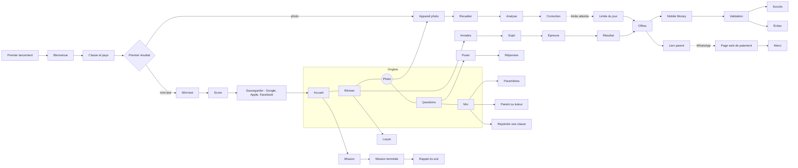

[Principes](#principes)[Logo](#logo)[Couleurs](#couleurs)[Typographie](#typo)[Fondations](#fondations) [Composants](#composants)[Carte de l'app](#carte)[Écrans](#ecrans)[Consignes](#consignes)[Pour le code](#code)[Classes](#classes)[Enseignant](#enseignant)[Classement](#classement)[États et animations](#etats)[Site web](#site)[Retours du test](#octobre)[Revue](#revue)[Questions](#questions)[Questions 2](#questions2)[Crédits](#credits)[Notifs, paiement, profil](#notifs)[Limites et suite](#suite) [Crédits](#credits)[Photo et crédits](#photo)[Paiement](#paiement)[Moi et Paramètres](#profil)[Parrainage](#recompenses)[Notifications](#notifs)

Elearn

Prepa

Charte graphique · design system · écrans · v1.0 · 30 sept. 2026

# Le tuteur de poche, dessiné.

Charte, tokens clair et sombre, composants et 48 écrans (en clair et en sombre) de la nouvelle app Android, iOS et web, construits à partir du cahier des charges v3 et du style néo-brutaliste des rapports.

[Ouvrir le fichier Figma](https://www.figma.com/design/GzCvMxp4YpqafQufUJ6xI8)

Figma · page ①

### Charte et design system

Couverture et principes, logo, couleurs, typographie, espaces, icônes, 8 composants en version claire et sombre.

Figma · page ②

### 8 parcours, 48 écrans

Chaque écran en clair et en sombre, avec son rôle et la référence du cahier des charges.

Ici

### Consignes et bonnes pratiques

Règles d'usage, clair et sombre, accessibilité, ton, états, mouvement, passage au code.

Dossier du projet

### Tokens pour Expo

`design/theme.ts` : palette, thèmes, typo, espaces, prêts à copier dans l'app.

01 · Principes

## Six règles qui décident à notre place

Quand on hésite sur un écran, on revient ici. Elles découlent des chiffres du rapport d'analyse : 89 % des visiteurs voyaient d'abord l'inscription, 6 % terminaient un contenu, 31 % des paiements réussissaient.

### Un résultat avant le compte

Une correction ou un score en moins de 2 minutes, sans inscription. Le compte vient après, pour sauvegarder.

### Clair comme un cahier

Une idée par bloc, bordures franches, grands chiffres. On comprend un écran en 3 secondes.

### La couleur a un sens

Vert = action et réussite. Jaune = à retenir. Orange = attention. Corail = erreur. Bleu = information.

### Léger, rapide, hors ligne

Pensé pour un Android de 2 Go en 3G : pas d'image lourde, vidéo toujours facultative, missions et fiches téléchargeables.

### Honnête et bienveillant

Pas de faux compte à rebours ni de fausse progression. La limite gratuite se dit avec calme, jamais en culpabilisant.

### Complice pour l'élève, rassurant pour le parent

Tutoiement et énergie pour l'élève ; vouvoiement, preuves et reçus pour le parent ou tuteur qui paie.

02 · Logo

## Le livre et l'élan, en aplat

On garde ce qui rend l'icône actuelle reconnaissable (le livre ouvert, la courbe qui monte) et on la passe dans le style de la marque : aplat émeraude, bordure noire, sans dégradé.

### À faire

- Espace libre autour du symbole : 1/4 de sa largeur.
- Taille minimale : 24 px à l'écran, 10 mm à l'impression.
- Sur une photo, poser le logo sur un aplat.
- Écrire « Elearn Prepa » (deux mots, deux majuscules).
- Icône Android adaptative : fond émeraude 500, symbole centré, masques rond et carré testés.

### À ne pas faire

- Ajouter un dégradé, une ombre floue ou un reflet.
- Recolorer le symbole ou le livre.
- Déformer ou pivoter le symbole (seule l'étiquette PREPA est inclinée).
- Écrire « E-learn », « ELearn » ou « Elearn prépa ».

03 · Couleurs

## Une palette courte, deux thèmes

Les écrans ne touchent jamais la palette : ils utilisent des couleurs **sémantiques** qui changent de valeur entre le thème clair et le thème sombre. Cette page elle-même suit votre réglage clair ou sombre.

### Palette

émeraude 500\
#10B981

émeraude 700\
#047857

émeraude 100\
#D1FAE5

encre 1000\
#0A0A0A

encre 900\
#141614

papier 50\
#FFF7E3

soleil 400\
#FFD83D

orange 500\
#FF7D00

corail 500\
#FF5A4F

bleu 500\
#1A75FF

Matières (identiques dans les deux thèmes, texte encre dessus) : maths bleu #5B9BFF, physique-chimie orange #FF9A3D, SVT herbe #7BC74D, français lilas #B69CFF, anglais rose #FF8FB1, histoire-géo soleil #FFD83D, philo menthe #8FD2C1.

| Token | Rôle | Clair | Sombre |
| --- | --- | --- | --- |
| `fond/app` | Fond de chaque écran | papier 50 | encre 900 |
| `fond/surface` | Cartes, feuilles, champs | blanc | encre 850 |
| `fond/creux` | Zones en retrait, désactivé, squelettes | papier 100 | encre 800 |
| `texte/principal` | Texte courant | encre 1000 | papier 300 |
| `texte/secondaire` | Texte d'appui | encre 500 | encre 400 |
| `texte/lien` | Liens, bouton fantôme | émeraude 700 | émeraude 300 |
| `bord/fort` | Toutes les bordures | encre | papier 200 |
| `marque/principale` | Bouton principal, succès | émeraude 500 | émeraude 400 |
| `marque/douce` | Onglet actif, fonds positifs | émeraude 100 | émeraude 950 |
| `accent/soleil` | À retenir, pass, série | soleil 400 | soleil 400 |
| `etat/alerte` | Attention, quota | orange 500 | orange 400 |
| `etat/erreur` | Erreur, réponse fausse | corail 500 | corail 400 |
| `etat/info` | Information, sélection | bleu 500 | bleu 400 |

### Contrastes vérifiés (WCAG 2.1 AA)

Texte principal sur fond : 18,6:1 en clair, 16,1:1 en sombre. Texte secondaire : 6,3:1 et 6,4:1. Encre sur émeraude 500 : 7,8:1. Encre sur soleil : 14,3:1. Lien émeraude 700 sur papier : 5,1:1. **Blanc sur émeraude 600 : 3,8:1, insuffisant** : sur la couleur de marque, le texte est toujours noir.

04 · Typographie

## Trois familles, déjà celles des rapports

Archivo Black pour les titres et les grands chiffres, Space Grotesk pour tout le texte, Space Mono pour les étiquettes et les données. Libres (SIL OFL). Minimum 13 px, texte courant 16 px, et les tailles suivent le réglage d'accessibilité du téléphone jusqu'à 130 %.

Titre/Affiche · 32/38Prêt pour le BEPC ?

Titre/H1 · 26/32Ta mission du jour

Titre/H2 · 21/26Correction pas à pas

Titre/H3 · 18/24Étape 2 · On isole x

Chiffre/XL · 44/4817/20

Texte/Normal · 16/24On soustrait 3 des deux côtés pour garder l'équilibre.

Texte/Petit · 14/203 corrections gratuites par jour

Bouton · 16/20Commencer la mission

Étiquette/Mono · 12/16Maths · 3e

Étiquette/Donnée · 13/182x + 3 − 3 = 11 − 3

Titres en casse normale (pas de capitales, sauf les étiquettes). Espaces insécables avant « ? ! : ; » et à l'intérieur des guillemets. Les formules s'écrivent en Space Mono ; pour les formules complexes, rendu KaTeX avec la même taille que le texte.

05 · Fondations

## Grille de 4, bordures franches, ombres dures

### Espaces

2 · 4 · 8 · 12 · 16 · 20 · 24 · 32 · 40 · 48 · 64

Écran de référence 360 × 800 (Android d'entrée de gamme). Marges latérales 16 px. Écart entre blocs 12 à 16 px. Cible tactile minimale 48 × 48 px.

### Rayons et bordures

Étiquettes 6, boutons et champs 10, cartes 14, puces et onglets en pilule. Bordures 2 px partout, 3 px pour le focus, l'erreur et l'élément choisi, 1,5 px pour les séparateurs.

### Ombres

Décalées, sans flou : 2 px (puces), 4 px (boutons, cartes), 6 px (feuilles, carte mise en avant). Appuyé : l'élément glisse de 4 px vers son ombre et l'ombre disparaît. Essayez :

06 · Composants

## Huit composants, leurs règles

Dans Figma, chaque composant existe en « Clair/… » et « Sombre/… » avec les mêmes noms de calques. Ici, ils sont vivants et suivent le thème de la page.

### Bouton

- Un seul bouton Primaire par écran, en bas, pleine largeur, 52 px.
- Accent (jaune) réservé au pass. Danger seulement pour supprimer.
- Libellé : un verbe, trois mots au plus (« Payer 2 500 FCFA », pas « Continuer vers le paiement »).

### Option de réponse

**A**x = 3

**B**x = 4 · choisie

5/6 · bonne réponse

3/9 · fausse

La couleur n'est jamais le seul signal : coche ou croix, et une phrase qui dit la bonne réponse et pourquoi.

### Puce et champ

Numéro Mobile Money

**+237**

Il manque un chiffre : 9 chiffres attendus.

Libellé toujours visible au-dessus du champ. L'erreur dit comment corriger.

### Bannière

*i*

**Astuce**\
Cadre bien tout l'exercice.

*!*

**Plus qu'1 correction aujourd'hui**\
Demain, tu en as 3 nouvelles.

*!*

**Le paiement n'est pas passé**\
Aucun montant n'a été retiré.

Dans la page, jamais en fenêtre bloquante. Hors ligne : bandeau encre en haut de l'écran.

### Barre d'onglets

Accueil · Réviser · **Photo** · Questions · Moi. Le bouton Photo central, émeraude et rond, ouvre directement l'appareil photo : c'est l'action n° 1. Texte toujours visible sous les icônes.

### Aussi dans les écrans

Carte (bordure 2, rayon 14, ombre 4), Étiquette mono, Bouton icône 44 px, Barre de progression, Interrupteur, Feuille du bas (bottom sheet) avec voile à 60 %, Squelette de chargement, Compteur de corrections.

07 · Carte de l'app

## Cinq onglets, une action centrale

Le premier lancement passe par l'entrée sans compte ; ensuite tout part des onglets. La page de paiement parent et l'espace enseignant sont des pages web.

08 · Écrans

## 8 parcours, 48 écrans, chacun en clair et en sombre

Tout est sur la page ② du fichier Figma, dans l'ordre du parcours, avec sous chaque écran son rôle et l'exigence qu'il couvre. Aperçus ci-dessous.

### A · Premier lancement : un résultat avant le compte

**A1 Bienvenue***élève ou concours, aucun compte (M1-01)*

**A2 Classe et pays***pays deviné du téléphone (M1-02)*

**A3 Premier résultat***photo ou mini-test (M1-03)*

**A4 Mini-test***une question par écran*

**A5 Score***point fort, point à revoir*

**A6 Sauvegarder***Google, Apple, Facebook, ignorable (M2-05)*

**A7 Ancien compte***rattachement (M2-06)*

Parcours A dans Figma, clair en haut, sombre en bas.

### B · Aide par photo : le cœur de la promesse

**B1 Appareil photo***compteur 2/3 visible (M3-01)*

**B2 Recadrer***matière devinée*

**B3 Analyse***attente honnête, \< 25 s*

**B4 Correction***pas à pas, partage WhatsApp (M3-02, M3-06)*

**B5 Signaler***2 appuis (M3-04)*

**B6 Limite du jour***calme, sans blocage (M3-03)*

Parcours B. L'appareil photo reste sombre dans les deux thèmes (correction à appliquer dans Figma, voir plus bas).

### C · Mission du jour : créer l'habitude

**C1 Accueil***mission en 1 appui (M4-01)*

**C2 Activité***bonne réponse et pourquoi*

**C3 Mission terminée***série, jour de grâce (M4-02)*

**C4 Rappel du soir***1 notification par jour (M9-01)*

**C5 Progression***semaine, matières, plan (M4-04)*

**C6 Hors ligne***7 jours téléchargés (M4-05)*

Parcours C.

### D · Réviser : cours, fiches et annales

**D1 Réviser***matières en couleur (M5-01)*

**D2 Leçon***10 min, vidéo facultative (M5-04)*

**D3 Annales***filtres, 1 sujet gratuit (M6-01, M6-02)*

**D4 Sujet***source et droits (M6-05)*

**D5 Épreuve***chrono réel (M6-03)*

**D6 Résultat blanc***correction détaillée au pass (M6-04)*

Parcours D.

### E · Pass et paiement : simple, fiable, honnête

**E1 Offres***après le 1er résultat, repère répétiteur (M8-01)*

**E2 Mobile Money***un seul bouton (M8-02)*

**E3 Validation***confirmée par le serveur, expire à 10 min*

**E4 Succès***reçu immédiat (M8-04)*

**E5 Échec***aucun montant perdu (M8-05)*

**E6 Lien parent***WhatsApp, 48 h (M8-06)*

Parcours E.

### F · Parent ou tuteur (web)

F1 page de paiement sans compte, F2 merci et reçu, F3 lien expiré, F4 résumé de la semaine (M8-06, M8-09, M8-11, M8-12). Vouvoiement.

### G · Fil des questions (lot 2)

G1 fil, G2 poser une question (numéros masqués), G3 réponses : IA d'abord, enseignant repéré, meilleure réponse (M7-01 à M7-05).

### H · Compte, réglages, écoles

H1 Moi, H2 paramètres (thème, taille du texte), H3 parent ou tuteur avec accord daté, H4 rejoindre une classe, H5 espace enseignant (web), H6 supprimer le compte (M2-07, M2-08, M10).

09 · Consignes

## Bonnes pratiques, écran par écran

### Toujours

- Donner de la valeur avant de demander quoi que ce soit (compte, paiement, notification).
- Placer l'action principale en bas, à portée de pouce.
- Montrer le compteur gratuit avant la limite, pas seulement quand elle tombe.
- Proposer « Envoyer à mon parent » à côté de chaque paiement.
- Afficher le poids d'un téléchargement et d'une vidéo.
- Garder un écran utilisable sans réseau, avec ce qui a été téléchargé.

### Jamais

- Écran de paiement avant le premier résultat.
- Faux compte à rebours, fausse jauge, faux « 95 % des élèves ont acheté ».
- Fenêtre bloquante pour vendre ou pour noter l'app.
- Plus d'une notification par jour, plus d'un message marketing par semaine.
- Messages privés entre élèves, numéro de téléphone visible.
- Texte blanc sur l'émeraude, gris clair sur une couleur.

### Clair et sombre

- Réglage dans Moi › Paramètres : Clair, Sombre, **Système par défaut**.
- En sombre, les bordures deviennent crème ; l'ombre reste noire et se voit peu : c'est voulu, la bordure porte la forme.
- Les couleurs vives (soleil, matières) ne changent pas ; leur texte reste noir.
- L'appareil photo et l'épreuve chronométrée restent sombres dans les deux thèmes.
- Tester chaque écran dans les deux thèmes avant de le livrer.

### Accessibilité

- Contraste AA vérifié pour tous les couples de tokens ; ne pas en inventer d'autres.
- Cibles de 48 × 48 px, espacées d'au moins 8 px.
- Texte qui suit la taille système jusqu'à 130 % sans couper les boutons.
- Chaque bouton icône a un libellé lu par le lecteur d'écran.
- La couleur ne porte jamais seule une information (juste, faux, sélectionné).
- « Réduire les animations » coupe les glissements.

### Ton et mots

- Élève : tutoiement, phrases courtes, encourageant sans infantiliser (« Pas tout à fait. La bonne réponse est C. »).
- Parent : vouvoiement, faits, montant, date, reçu (« Le pass d'Aïcha est activé »).
- On dit « correction », « mission », « pass », « parent ou tuteur », « Mobile Money ». Pas « paywall », « premium », « abonnement ».
- Une erreur dit ce qui s'est passé et comment s'en sortir, et rassure sur l'argent.
- Prix toujours écrits en entier : « 2 500 FCFA ».

### États à prévoir sur chaque écran

**Chargement** : squelette aux formes du contenu, jamais un écran blanc. **Vide** : une phrase et une action (« Pose ta première question »). **Erreur réseau** : bannière + « Réessayer », le contenu déjà là reste affiché. **Hors ligne** : bandeau encre en haut. **Pays sans pack local** : le socle commun, et une ligne qui le dit.

### Mouvement

Appui 120 ms (glissement de 4 px), transitions 200 ms, feuille du bas 300 ms, courbe « ease-out ». Une seule célébration : fin de mission et paiement réussi (petit rebond du trophée ou de la coche). Pas de confettis, pas d'animation en boucle : cela coûte de la batterie sur les petits téléphones.

### Plateformes

Mobile d'abord (360 px). Web : même app centrée sur 480 px de large jusqu'à la tablette ; la page parent et l'espace enseignant sont des pages web légères (moins de 200 Ko). iOS : bouton « Continuer avec Apple » obligatoire, et le paiement du pass passe par Apple sauf règle contraire (M8-13) : prévoir l'écran Offres en variante achat intégré.

10 · Pour le code

## Du fichier Figma à l'app Expo

### Tokens

Le fichier `design/theme.ts` du dossier du projet reprend exactement les variables Figma : `palette`, `themes.light` et `themes.dark`, `typo`, `espace`, `rayon`, `bord`, `ombre`, `mouvement`. Un `ThemeProvider` choisit le thème avec `useColorScheme()` et le réglage du profil.

### Ombres sur Android

`elevation` floute l'ombre. Dessiner l'ombre avec une vue de même forme, décalée de 4 px, derrière le composant ; à l'appui, translater le composant de 4 px et masquer l'ombre. Un seul composant `<Brut>` fait ça pour les boutons et les cartes.

### Polices et poids

Charger avec `expo-font` : Archivo Black 400, Space Grotesk 400/500/700, Space Mono 400/700 (≈ 400 Ko au total). Icônes : `lucide-react-native`, trait 2, tailles 24/20/18.

### Noms

Les noms de composants et d'écrans du fichier Figma (Bouton, Puce, Option de réponse, Champ, Bannière, Barre d'onglets ; A1 à H6) servent de noms de tickets et de tests, à côté des identifiants du cahier des charges (M1-01…).

11 · Classes, côté élève

## La mission de la classe arrive là où l'élève regarde déjà

L'élève ne va pas chercher ses missions de classe : elles s'affichent sur l'accueil, juste sous la mission du jour. Une page par classe regroupe ensuite tout le reste.

Lun. 12 oct. 6 jours

Bonsoir Aïcha

Mission du jour**Thalès, 4 activités**10 min · adaptée à tes points faiblesCommencer

3e BM. Mbarga · avant jeu.

**Fractions : 8 questions**« Révisez avant le contrôle de vendredi. »Faire la mission

**2 autres missions de classe**›

AccueilRéviserQuestionsMoi

**C1 Accueil** avec le bloc « Ma classe » : la mission la plus urgente, puis un lien vers les autres.

‹Code K7P2X9

3e B

Collège Les Pionniers · M. Mbarga · 32 élèves

MissionsClassementInfos

À faire

**Fractions**jeu.

8 questions · 12 min

**Lecture : le conte**lun.

Leçon + 5 questions

En retard

**Pythagore**hier

Tu peux encore la faire

Terminées

**Équations**7/8

**H7 Ma classe** : trois onglets. Les missions sont triées par urgence ; une mission en retard reste faisable, sans reproche.

Mission envoyée

M. Mbarga voit que tu l'as faite.\
Ton score reste entre toi et toi.

Score**7 / 8**

Série **7 jours**

*i*Elle compte comme mission du jour : ta série continue.

Voir les corrections

**C3b Fin de mission de classe** : même lecteur que la mission du jour, avec une fin qui dit ce que l'enseignant voit.

### Règles

- On rejoint une classe par un lien WhatsApp ou un code à 6 caractères (H4), en 2 appuis (M10-01).
- Plusieurs classes sont possibles : l'accueil montre la mission la plus urgente, toutes classes confondues.
- Une mission de classe faite le jour même compte comme mission du jour, pour ne pas doubler la charge.
- Une notification par nouvelle mission, regroupée avec le rappel du soir si elle arrive après 17 h.
- « Quitter la classe » est dans l'onglet Infos, avec une confirmation.

### Nouveaux écrans

**C1 Accueil***bloc « Ma classe » ajouté*

**H6 Mes classes***liste, rejoindre une autre*

**H7 Ma classe***Missions, Classement, Infos*

**C3b Fin de mission de classe***« envoyée à l'enseignant »*

12 · Classes, côté enseignant

## Créer une mission en trois écrans, sur téléphone ou sur le web

C'est l'**enseignant relais** qui crée ses classes et leurs missions. L'**école relais** (directeur, préfet des études) voit toutes les classes de ses enseignants. Le **partenaire** du module M11 (école privée, sponsor) est un annonceur : il n'a pas de classe et ne crée pas de mission.

‹Enseignant

3e B

Inviter les élèves**K7P2X9**

CopierWhatsApp

Inscrits**32**

Actifs cette sem.**24**

Missions

**Fractions**18/32

\+ Nouvelle mission

**H5 Espace enseignant › Classe** : code et lien en haut, puis l'avancement de chaque mission.

1 / 3

Que doivent-ils travailler ?

Chercher un chapitre…

MathsFrançaisPC

**Fractions**\
Quiz auto · 8 questions

**Leçon : Fractions**\
Leçon courte · 6 min

**BEPC 2024, exercice 2**\
Annale · 15 min

Suivant

**H8 Nouvelle mission · contenu** : on choisit dans la bibliothèque existante, rien à rédiger. On peut combiner une leçon et un quiz.

‹2 / 3

Pour qui, pour quand ?

Classes

3e B3e C4e A

À faire avant

Jeudi 15 octobre, 20 h

Message (facultatif)

Révisez avant le contrôle de vendredi.

Notifier les élèves

Voir l'aperçu

**H9 Nouvelle mission · réglages**, puis **H10 Aperçu** (la mission telle que l'élève la verra) et « Publier ».

‹jeu. 20 h

Fractions · 3e B

Faite**18/32**

Moyenne**71 %**

Questions les plus ratées

Q5 · simplifier 18/24**38 %**

Q7 · somme de fractions**44 %**

Pas encore faite (14)

Brice N., Chantal E., Didier M., …

Relancer les 14

**H11 Suivi de mission** : qui l'a faite, la moyenne et les questions ratées. Jamais la note d'un élève en particulier (M10-02).

### Où l'enseignant travaille

Dans l'app : Moi › Espace enseignant (visible quand le compte a le rôle enseignant). Sur le web : elearnprepa.com/enseignant, mêmes écrans en plus large, plus pratique pour préparer plusieurs missions. Le rôle enseignant est accordé par le back-office après vérification (M12-07).

### Ce que l'enseignant voit, et ne voit pas

- Nombre d'inscrits et d'actifs, missions faites ou non, moyenne de la classe, questions ratées.
- Le prénom et l'initiale des élèves, pour savoir qui relancer.

- Pas la note individuelle, pas les photos envoyées au tuteur, pas les paiements.

13 · Classement

## Récompenser l'effort, et laisser chacun disparaître

Le classement compte les points d'effort de la semaine (missions faites, bonnes réponses), pas les notes. Il repart de zéro chaque lundi. Il existe par classe et par concours (M6-06). Chaque élève choisit s'il y apparaît.

‹Semaine 42

Classement · 3e B

MissionsClassementInfos

1**Kevin T.**480

2**Mireille A.**455

3**Élève masqué·e**—

4**Junior K.**390

7**Toi**310

Encore 1 mission pour passer 6e.

Apparaître dans ce classement

**H7 Ma classe · Classement** : le top de la semaine, ta place toujours visible, et l'interrupteur directement sous la liste.

Qui peut voir ton nom ?

Le classement de la classe compte l'effort de la semaine. Tu peux changer d'avis quand tu veux dans Paramètres.

**Ma classe voit « Aïcha D. »**

**Un pseudo**\
ex. « Lionne237 »

**Personne**\
Je vois ma place, les autres non

Valider

**H12 Choix de visibilité** : demandé une seule fois, au premier classement ouvert.

‹

Confidentialité

Classements

Classements de mes classes

Classement du concours

Nom affiché**Aïcha D. ›**

Parents et enseignants

Résumé hebdo au parent

Masqué, tu gardes ta place et tes points ; seul ton nom disparaît pour les autres.

**H2 Paramètres › Confidentialité** : un réglage par classement, et le nom affiché.

### Réglages par défaut

- Classement de classe : visible sous « prénom + initiale », puisque la classe se connaît déjà.
- Classement de concours (des inconnus) : masqué par défaut, activable.
- Un élève masqué apparaît comme « Élève masqué·e », sans nom ni points, pour que les rangs restent justes.
- Pas de classement dans le fil des questions ni sur les pages publiques.

14 · Succès, erreurs, animations

## Chaque action répond, sans en faire trop

Chaque action importante reçoit un geste visuel, un son court et une vibration légère (M16). Les petites actions ont un retour discret ; seuls les grands moments ont une célébration complète. Un son ou une vibration n'est jamais seul : l'information est toujours visible à l'écran. Les sons se jouent avec ▶ dans le tableau.

### Messages courts

En bas, au-dessus des onglets, 4 secondes, une action au plus.

Mission ajoutée à tes téléchargements

*!*Envoi impossible, pas de réseau**Réessayer**

*i*Aïcha a rejoint la 3e B**Annuler**

### Essayer

Chaque animation se coupe si le téléphone demande de réduire les animations.

**B**Bonne réponse

**C**Mauvaise réponse

| Moment | Son | Vibration | Animation | Animations réduites |
| --- | --- | --- | --- | --- |
| Appui sur un bouton, une option, un onglet | Aucun par défaut (clic très léger en option) | Sélection légère | Le bouton s'enfonce : décalage de 4 px, l'ombre disparaît (120 ms) | Changement de couleur seul |
| Bonne réponse | « Ding » court en deux notes | Succès léger | Option verte, coche qui apparaît, petit rebond (200 ms) | Couleur et coche, sans rebond |
| Mauvaise réponse | Deux notes graves et douces, non punitives | Erreur légère (double tap court) | Option corail, secousse de 4 px, puis la bonne réponse s'allume (240 ms) | Couleur seule |
| Validation : photo envoyée, sauvegarde, lien copié | Petit « pop » | Sélection | Coche qui se trace (200 ms) | Coche fixe |
| Correction IA prête | Arrivée discrète | Légère | Les étapes apparaissent une à une | Tout apparaît en fondu |
| Fin de mission, résultat de concours blanc | Mélodie d'une seconde | Succès | Score qui monte, confettis légers (900 ms) | Score affiché en fondu, sans confettis |
| Série prolongée, jour de grâce utilisé | Course montante et scintillement | Succès | La flamme s'anime, le compteur monte d'un cran | Compteur mis à jour en fondu |
| Crédits gagnés, palier atteint, parrainage validé (M15) | Arpège brillant | Succès marqué | Écran de célébration, compteur de crédits qui défile | Écran en fondu, chiffre final affiché |
| Paiement confirmé, pass activé (M8) | Accord qui s'ouvre, puis cloche | Succès marqué | Coche tracée, puis le reçu glisse vers le haut (300 + 200 ms) | Écran de succès en fondu |
| Erreur réseau, paiement échoué, quota atteint | Aucun son | Erreur légère | Bannière claire avec une action (réessayer, revenir demain) | Identique |
| Concours blanc chronométré : 5 dernières minutes | Deux notes courtes (seul son pendant l'épreuve) | Légère | Le chrono passe à l'orange | Identique |
| Concours blanc : fin de l'épreuve | Cloche | Légère | Le chrono passe au corail, écran de fin | Identique |
| Chargement | Aucun son | Aucune | Blocs « creux » qui pulsent doucement (1 200 ms en boucle) | Blocs fixes |
| Changer d'écran | Aucun son | Aucune | Glissement latéral 200 ms ; feuille du bas 300 ms | Fondu 150 ms |

‹

Sons et vibrations

**Sons**\
Bonne réponse, fin de mission, récompenses

Aperçu

**Vibrations**\
Retour léger sous le doigt

Aperçu

**Animations réduites**\
Les célébrations deviennent un simple fondu

**Volume**FaibleNormal

Si ton téléphone est en silencieux ou en vibreur, l'app reste silencieuse. Elle ne coupe jamais ta musique.

**H2b Paramètres › Sons et vibrations** (M16-02) : trois réglages séparés, chacun avec son aperçu, appliqués tout de suite.

Mission terminée !

8 / 10

Série **7 jours**

Tu peux couper les sons dans Paramètres**Réglages**

**Première célébration** (M16-06) : le message n'apparaît qu'une fois, en bas, sans bloquer l'écran.

### Règles

- Un seul service de retours : chaque écran demande un moment (success, error, reward…), jamais un son en direct (M16-01).
- Au plus une célébration complète par écran, et seulement pour une action faite par l'élève.
- Aucun son pendant un concours blanc, sauf l'alerte des 5 dernières minutes et la fin.
- Aucun son ni vibration pour les notifications marketing.
- 11 sons originaux, domaine public (CC0), 56 Ko en tout, préchargés au démarrage : dossier design/sons.

Plein écran

### Erreur réseau

Ce qui a été gardé, et « Réessayer ». Le brouillon n'est jamais perdu.

Plein écran

### Liste vide

Une phrase utile et une action : « Aucune mission de classe. Rejoindre une classe ».

Plein écran

### Mise à jour requise

Un seul bouton vers le magasin, et ce que la version apporte.

Plein écran

### Pays sans pack local

Le socle commun reste disponible, et « Préviens-moi quand ton pays arrive ».

15 · Site web

## Un site qui vend l'app, et qui porte les pages publiques

Le site actuel (elearn-site, Next.js) est une seule longue page tournée vers les concours. Le nouveau garde la même base technique, reprend la charte de l'app, et ajoute les pages que l'app partage : paiement par le parent, correction partagée, invitation de classe.

| Adresse | Page | Pour qui | Ce qu'elle doit obtenir |
| --- | --- | --- | --- |
| / | Accueil | Élève | Installer l'app ou « Essayer sans compte » (premier résultat en ligne) |
| /parents | Parents et tuteurs | Parent | Comprendre le pass, le lien de paiement et le résumé hebdo |
| /ecoles | Écoles relais | Enseignant, directeur | Créer une classe, programme d'apport (10 000 FCFA), contact |
| /partenaires | Partenaires | École privée, sponsor | Demander le kit annonceur (M11) |
| /tarifs | Pass | Tous | Prix du pays (lus sur le back-office), moyens de paiement pawaPay |
| /concours/\[nom\] | Fiche concours | Candidat | Dates, épreuves, un sujet gratuit ; bon référencement Google |
| /aide · /contact | Aide | Tous | Questions fréquentes, WhatsApp support |
| /cgu · /confidentialite · /supprimer-mon-compte | Légal | Tous | Obligatoire pour Google Play et l'App Store |
| /payer/\[jeton\] | Paiement parent (F1–F3) | Parent | Payer le pass de l'enfant en Mobile Money, sans compte |
| /parent/\[jeton\] | Résumé parent (F4) | Parent | Voir la semaine de l'enfant |
| /c/\[id\] | Correction partagée | Ami de l'élève | Lire la correction, puis installer l'app (M3-06) |
| /rejoindre/\[code\] | Invitation de classe | Élève | Ouvrir l'app sur la bonne classe, ou l'installer d'abord |
| /enseignant | Espace enseignant web | Enseignant | Classes et missions, comme dans l'app (section 12) |

**Elearn Prepa**ParentsÉcolesTarifsTélécharger

Gratuit pour commencer

Bloqué sur un exercice ? Prends-le en photo.

La correction pas à pas en 30 secondes, et une mission de 10 minutes par jour pour ne plus bloquer.

Google PlayApp StoreEssayer sans compte

**1. Photo**l'exercice du soir

**2. Correction**expliquée, pas juste la réponse

**3. Mission**10 min par jour

**Pour les parents :** recevez un lien, payez le pass en Mobile Money, suivez la semaine.

**Accueil** : même promesse que l'app, deux boutons de magasin et l'essai sans compte, puis trois étapes, les parents, les écoles, les prix et la FAQ.

Paiement sécurisé **Aïcha vous demande le Pass Trimestre** 3 mois d'aide photo illimitée, de missions et d'annales corrigées.

Montant**2 500 FCFA**

+237 6XX XX XX XX

MTN MoMoOrange Money

Payer 2 500 FCFA Paiement traité par pawaPay. Lien valable 48 h.

**/payer/\[jeton\]** : la page que le parent ouvre depuis WhatsApp. Sans compte, un numéro, un opérateur, un bouton.

### Choix techniques pour le site

- On garde Next.js, next-intl (français, anglais) et PostHog, déjà en place dans le dépôt.
- On retire Ant Design : les composants du site reprennent ceux de l'app, en Tailwind, avec les mêmes tokens que theme.ts.
- Une vraie page par sujet au lieu d'ancres (#tarifs, #concours), pour le référencement.
- Les pages /payer, /parent, /c et /rejoindre sont servies côté serveur et restent légères pour la 3G.
- Maquettes Figma : un fichier séparé « Elearn Prepa 2 · Site web », en bureau (1440 px) et en mobile (390 px), clair et sombre.

16 · Retours du test

## Les écrans ajoutés après le test de l'app

Retours de Benny du 30 septembre et du 1ᵉʳ octobre, dessinés ici en attendant Figma. Chaque maquette suit les composants et les couleurs du design system ; l'agent dev peut s'en servir tels quels.

### Mission du jour, série et résultats

Jeu. 1 oct. 6 jours

Bonsoir Aïcha

**Ta série**Record : 12 jours ›

LMMJVSD

Fais ta mission ce soir pour passer à 7 jours.

Mission du jour**20 questions · 5 leçons**≈ 15 min · adaptée à tes points faiblesCommencer

AccueilRéviserQuestionsMoi

**C1 Accueil · carte de série** : les 7 derniers jours cochés, le jour de grâce en bleu, aujourd'hui en pointillé. Un appui ouvre le mois.

‹Octobre 2026

6 jours de suite

Record**12**

Ce mois-ci**19 j**

LMMJVSD 1234 567891011 12131415161718 19202122232425

1 jour de grâce par semaine : un oubli ne casse pas ta série.

**C5b Ma série** : le mois en détail. Coché = mission faite, bleu = jour de grâce, vide = jour manqué.

Mission du jour

14 / 20 · bien joué

Touche une case pour revoir la question.

1234567891011121314151617181920

Juste 14Faux 4Sans réponse 2

Refaire mes 6 erreurs Revoir la correction Revoir les leçons ratées (2)

**Résultats · écran commun** à tous les quiz (M5-10). Ordre : Refaire mes erreurs, Revoir la correction, Revoir les leçons ratées ; pour le quiz d'une seule leçon, ce dernier devient « Relire la leçon ». Sans erreur : Revoir la correction seul.

‹ RésultatsQuestion 3 / 20

12345678910

Maths · Fractions **Simplifie 18/24.**

6/8 · ta réponse

3/4

ExplicationDivise en haut et en bas par le plus grand diviseur commun, 6 : 18÷6 = 3 et 24÷6 = 4. 6/8 est juste mais pas encore simplifiée.

‹ PrécédenteSuivante ›

**Revoir une question** : la grille reste en haut pour sauter d'une question à l'autre. L'icône juste ou faux remplace la lettre, à gauche.

Ta mission, à ton rythme

QuestionsTemps

Combien de questions par jour ?

−**20**+

5Conseillé : 15 à 3050

Valider Modifiable dans Paramètres › Ma mission du jour

**M4-08 Réglage de la mission**, proposé une fois à la fin de la première mission. L'onglet « Temps » propose 10 à 45 minutes.

### Réviser : matières, chapitres et entraînement

**Réviser**

CoursS'entraînerFichesAnnales

**Maths**62 %

**Physique-chimie**40 %

**SVT**55 %

**Français**48 %

**Anglais**20 %

**Histoire-géo**10 %

AccueilRéviserQuestionsMoi

**D1 Réviser** : une icône propre à chaque matière (même couleur qu'avant) et un 2ᵉ onglet « S'entraîner ».

**Maths · 3e**62 %

**1. Nombres relatifs**\
5 leçons · quiz réussiTerminé

60 %**2. Fractions**\
3 / 5 leçons›

**3. Puissances**\
4 leçons · quiz réussiTerminé

0 %**4. Théorème de Thalès**\
6 leçons›

Chargement

**D1b Chapitres** : un chapitre fini garde sa place, en vert, coché, avec l'étiquette « Terminé ». En bas, le squelette de chargement (blocs qui pulsent).

**Réviser**

CoursS'entraînerFichesAnnales

MathsPCSVTFrançais

Fractions

**Quiz · 10 questions**\
Facile · ≈ 6 min8/10

**Exercices · 4 problèmes**\
Moyen · corrigés pas à pas›

Théorème de Thalès

**Quiz · 15 questions**\
Moyen · ≈ 10 min›

**Quiz défi · 20 questions**\
Difficile · chronométréPass

**D7 S'entraîner** : quiz et exercices libres par matière puis par chapitre, avec le meilleur score déjà fait. L'exercice réutilise l'écran d'activité, le résultat l'écran commun.

**Fractions**60 %

ToutQuizExercices

**Leçon 1 · Écrire une fraction**

?**Quiz · 10 questions**\
Meilleur score 8/10›

**Exercices · 4 problèmes**\
Corrigés pas à pas›

0 %**Leçon 4 · Additionner**›

**D1c Page chapitre** (M5-12) : onglets Tout, Quiz, Exercices. Quiz en bleu avec « ? », exercice en orange avec un crayon.

**Quiz · Fractions**

Questions**10**

Meilleur**8/10**

Mes sessions

**30 sept. · 8/10**\
6 minRevoir ›

12345678910

**28 sept. · 5/10**\
9 minRevoir ›

12345678910

Nouvelle session

**D8 Fiche d'un quiz déjà fait** (M5-13) : infos, historique des sessions avec leur grille, « Nouvelle session ». La première fois, le quiz démarre directement.

Chapitre terminé !

Fractions · 5 leçons sur 5

**Va plus loin**

Quiz du chapitre · 10 questions›

Exercices corrigés · 4 problèmes›

Sujet d'annale lié · BEPC 2024›

Faire le quiz du chapitre Chapitre suivant : Puissances

**Fin de chapitre** : proposée après la dernière leçon. Le quiz, les exercices et une annale liés au chapitre.

### Leçon : en-tête fixe, retour en haut, validation

**Fractions · Leçon 3/5**⋯

… suite de la leçon : l'en-tête reste visible pendant tout le défilement.

Exemple2/3 + 1/6 = 4/6 + 1/6 = 5/6

Pour additionner deux fractions, on les met d'abord au même dénominateur…

À retenir : on additionne les numérateurs, jamais les dénominateurs.

↑ Leçon suivante

**D2 Leçon** : en-tête collé en haut (titre, retour, progression) ; le bouton rond « Revenir en haut » apparaît après deux écrans de défilement.

Valide ta leçon

Réponds à 3 questions pour que ta progression compte. Il faut 2 bonnes réponses.

Répondre aux 3 questions Relire la leçon Sans validation, la leçon reste « commencée ».

**D2b Feuille de validation** : s'ouvre sur « Leçon suivante » tant que les questions ne sont pas réussies.

### Annales : mode concours et mode élève

**Annales**

⤓**Mes documents**\
3 gardés · 182 Mo›

ENSP Yaoundé · 27 sujets

Année

Toutes202520242023Plus

Épreuve

ToutesÉcritOral

Matière

MathsPhysiqueChimie

**Physique 2025**\
Écrit · 2 hGratuit

**Physique 2024**\
Écrit · 2 hPass

**Physique 2023**\
Écrit · 2 hPass

**D3 Annales, mode concours** (M6-01) : les sujets du concours choisi directement, filtrés par année, épreuve et matière. Pas de dossier « Autres concours » : on change de concours depuis le profil. « Mes documents » en tête, visible hors ligne.

**Annales**

Ma classe

**Terminale C**\
Bac · 6 matières›

Autres

**Autres classes**\
3e à Terminale›

**Concours**\
ENS, médecine, écoles d'ingénieurs›

**D3a Annales, mode élève** : la classe de l'élève en premier ; les autres classes et les concours rangés dans deux dossiers.

**ENSP Yaoundé**

Annales › Concours › ENSP Yaoundé

ToutesMathsPhysiqueChimie

**2025**\
3 épreuves

**Maths** · 3 hGratuit

**Physique** · 2 hPass

**Chimie** · 2 hPass

**2024**\
3 épreuves›

**2023**\
3 épreuves›

**D3b Un concours, depuis le mode élève** : dossiers par année, épreuves dedans. Plus de rangée de sigles : on est déjà dans le concours.

**Terminale C**

Annales › Classes › Terminale C

**Maths**\
Bac 2015 à 2025 · 11 sujets›

**Physique-chimie**\
11 sujets›

**SVT**\
9 sujets›

**Français**\
10 sujets›

**Philosophie**\
11 sujets›

**D3c Une classe** : dossiers par matière, puis les sujets par année (même écran que D3b).

### Lecteur PDF et documents hors ligne (M6-08)

**Physique 2025**3 / 12

Reprise à la page 3

−120 %+

**D9 Lecteur** : titre et page X / Y en haut, défilement continu, zoom (boutons et pincer), reprise à la dernière page lue. Aucun bouton télécharger ni partager.

**ENSP Yaoundé**

**Physique 2025**\
Écrit · 2 h Hors ligne

**Physique 2024**\
Téléchargement… 3,1 / 4,8 Mo

**Physique 2023**\
Écrit · 2 h · 4,2 MoPass

**Ouverture de Physique 2024**

Premier téléchargement : ensuite il s'ouvrira sans connexion.

**D9b Hors ligne** : pastille « Hors ligne » sur les documents gardés ; au premier téléchargement, progression avec annulation, sur la liste et dans le lecteur.

**Mes documents**

**Place utilisée**182 / 500 Mo

Plafond de 500 Mo : supprime un document pour en garder un autre.

**ENSP 2025 · Physique**\
4,8 Mo · ouvert hier

**ENSP 2025 · Maths**\
6,2 Mo · il y a 3 jours

**Bac C 2024 · Maths**\
3,9 Mo · il y a 2 semaines

**D10 Mes documents** : en tête de l'onglet Annales et dans Paramètres ; taille de chaque fichier, suppression, place utilisée sur 500 Mo. « Tout supprimer » ouvre une feuille de confirmation. Clair et sombre via le bouton de thème du guide.

### Profil : classe, statut et concours en deux étapes

**Ma situation**

**Je suis élève**\
Collège ou lycée

**Je prépare un concours**\
Après le bac

Mon concours

**ENSP Yaoundé**\
Écoles d'ingénieurs · juillet 2027**Changer**

Pays

**Cameroun**\
Programme francophone**Changer**

Enregistrer

**H1b Ma situation** (Moi › Changer de classe ou de statut) : statut, puis concours ou classe, puis pays. Le texte de la carte Pays tient sur deux lignes.

**1 / 2**

Quelle filière vises-tu ?

**Écoles normales (ENS)**\
8 concours

**Médecine et santé**\
6 concours

**Écoles d'ingénieurs**\
11 concours

**Commerce et gestion**\
5 concours

Suivant

**Concours · étape 1** : la filière. Utilisé à l'accueil (A2) et depuis le profil.

**2 / 2**

Quel concours ?

Écoles d'ingénieurs · Cameroun

Chercher

**ENSP Yaoundé**\
Juillet · maths, physique, chimie

**ENSPD Douala**\
Juillet · maths, physique

**FGI Douala**\
Août · maths, physique, anglais

Choisir ENSP Yaoundé Ton programme et tes annales suivent ce concours. Tu peux changer quand tu veux.

**Concours · étape 2** : les concours de la filière, avec la date et les épreuves.

### Feuilles pour l'invité

Connecte-toi pour payer

Ton pass sera lié à ton compte : tu le gardes même si tu changes de téléphone.

Continuer avec Google Continuer avec Apple Continuer avec Facebook En continuant, tu acceptes les **conditions d'utilisation** et la **politique de confidentialité**.

**Connecte-toi** : avant une action qui exige un compte (payer, rejoindre une classe, poser une question).

Garde ta progression

Missions**9**

Série **6**

Sans compte, tout ça disparaît si tu changes de téléphone ou effaces l'app.

Sauvegarder en 1 appui Plus tard

**Rappel de compte** : après 3 missions ou 3 jours sans compte, puis au plus une fois par semaine.

Un rappel le soir ?

Un seul message par jour, à l'heure de ton choix, pour ne pas casser ta série. Jamais de pub.

Heure**20 h 00 ›**

Oui, me rappeler Pas maintenant

**Notifications** : notre feuille explique d'abord ; la fenêtre du téléphone ne s'ouvre qu'après « Oui ».

Te déconnecter ?

Tes données sur ce téléphone seront effacées. Ta progression reste sur ton compte.

*!*2 missions faites hors ligne ne sont pas encore envoyées. Connecte-toi à internet avant, sinon elles seront perdues.

Me déconnecter Annuler

**M2-14 Déconnexion** : confirmation, avertissement seulement s'il reste des données non envoyées, puis retour au premier écran (A1).

18 · Revue du 1er octobre

## Revenir à la qualité du début

Revue des écrans faits sans maquette, à partir des captures de Benny. À gauche l'app actuelle, au centre la correction, à droite ce que le dev change. Tout se fait avec les composants et les variables déjà dans theme.ts.

### Huit règles valables partout

1. **Une seule épaisseur.** Bordure 2 px, ombre 3 px sur les cartes de liste, 4 px sur les boutons. Les cartes actuelles ont une ombre de 6 à 8 px qui alourdit tout.
2. **Des cartes compactes.** Carte de liste : 64 à 72 px de haut, marge 10 px, titre en Space Grotesk Bold 15 sur 2 lignes au plus (numberOfLines={2}).
3. **Des couleurs qui veulent dire une chose.** Couleurs de matière pour les matières seulement ; bleu = quiz, orange = exercice, vert = réussi et action principale, corail = erreur. Le violet est déjà le Français : pas pour les exercices.
4. **Une seule action verte par écran.** Les autres boutons sont blancs (secondaires) ou en texte.
5. **Un seul jeu d'icônes.** Lucide, trait 2, 18 à 20 px. Quand l'icône dit le type d'un contenu, elle est dans une pastille de 34 px aux couleurs du type.
6. **Des titres propres.** Une fonction formatTitle pour les titres de la base : retirer le nom du chapitre répété, séparer le numéro collé (« 10mouvement » → « Quiz 10 »), corriger les majuscules (« sequence 6 COLLEGE PRIVE » → « Séquence 6 · Collège privé laïc Mongo Beti »).
7. **Les erreurs en plein écran.** Jamais un bandeau rose seul en haut d'une page vide : une icône, une phrase, « Réessayer », et ce qui marche encore hors ligne. Squelette d'abord, erreur ensuite.
8. **Les intitulés en français.** « Social studies » devient « Études sociales » (à corriger dans le contenu ou par une table de libellés).

AvantPage chapitre actuelleListe des quiz actuelle

**Actions mécaniques et énergie électrique**20 %

ToutQuizExercices

?**Quiz · Module 2**\
6 questions83 %

**Identifier les actions mécaniques**Exercice 1 / 5Fait

?**Quiz du chapitre**\
6 questions›

**Calcul de l'énergie électrique**Exercice 2 / 5›

**Vrai ou faux sur les circuits**Exercice 3 / 5›

**Page chapitre** (M5-12, maquette D1c) : cinq éléments visibles au lieu de deux et demi.

### Ce qui change

1. Retirer le surtitre en capitales « QUIZ » / « EXERCICE 1/5 » : le type se lit sur la pastille, le rang passe en sous-titre.
2. Pastille 34 px : quiz bleu avec « ? », exercice **orange** avec un crayon (plus de violet).
3. Titre sans le nom du chapitre (déjà dans l'en-tête) : « … – Module 2 » devient « Quiz · Module 2 ». Même règle sur la liste « Chapitre 11 » : « 10mouvement dans les champs… » devient « Quiz 10 ».
4. Score à droite dans une pastille (verte si ≥ 50 %), « Fait » pour un exercice terminé ; fond vert doux sans ombre pour ce qui est fini, comme les chapitres.
5. En-tête : titre sur 2 lignes au plus, en 15 px, avec la progression du chapitre à droite. Onglets à la hauteur du guide (40 px), pas 56.
6. Supprimer le titre de section « Quiz » en gros caractères : les onglets suffisent.

AvantCapture de l'app actuelle

**Réviser**

CoursS'entraînerAnnales

**Physique et techno**13 %

**Maths**0 %

**Informatique**0 %

**Français**0 %

**Histoire**0 %

**Études sociales**0 %

**Éducation civique et morale**25 %

**Géographie**0 %

**Réviser · Cours** (M5-07, maquette D1) : tuiles de même hauteur, pas deux couleurs voisines identiques.

### Ce qui change

1. Tuiles de même hauteur (la plus haute de la rangée), nom sur 2 lignes au plus.
2. Icône dans une pastille blanche de 32 px (bord noir), en haut à gauche : aujourd'hui elle est petite et se perd.
3. Plus de tuile blanche : chaque matière a une couleur de la palette. Une matière sans couleur prévue prend la suivante dans la liste, sans jamais répéter la couleur d'une voisine (aujourd'hui trois jaunes à la suite).
4. « 0 % validé » devient « 0 % » et une barre fine : on lit la progression d'un coup d'œil.
5. Ordre : les matières commencées d'abord, puis l'ordre du programme.

AvantCapture de l'app actuelle

Quiz · Module 2

6 / 8 · bien joué

Touche une case pour revoir la question.

12345678

Juste 6Faux 2

Refaire mes 2 erreurs Revoir la correction Relire la leçon

**Résultats** (M5-10) : même écran pour tous les quiz.

### Ce qui change

1. Un titre qui parle : « 6 / 8 · bien joué » en Archivo Black, le nom du quiz en haut.
2. Ajouter le 3ᵉ bouton : « Revoir les leçons ratées (n) », ou « Relire la leçon » pour le quiz d'une seule leçon.
3. « Terminer » n'est plus un 2ᵉ bouton vert : c'est la croix en haut à gauche. Les trois boutons se groupent en bas, à portée du pouce.
4. Grille de 5 colonnes de cases carrées, légende avec les mêmes carrés de couleur ; orange pour « sans réponse » quand il y en a.
5. Retirer l'avatar en haut à droite sur cet écran : il n'a rien à y faire.

AvantCapture de l'app actuelle

**Annales**

⤓**Mes documents**\
3 gardés · 182 Mo›

ENSPD · 1ʳᵉ année · 9 sujets

Toutes202520242023

ToutesMathsPhysiqueChimie

**Maths 2025**\
Écrit · 3 hGratuit

**Physique 2025**\
Écrit · 2 h Hors ligne

**Maths 2024**\
Écrit · 3 hPass

**Annales, mode concours** (M6-01, maquette D3).

### Ce qui change

1. En mode concours, plus de carte « Mon concours » ni de dossier « Autres concours » : les sujets du concours choisi s'affichent tout de suite, avec les filtres année, épreuve, matière.
2. Plus d'icône trophée au trait isolée : le statut d'un sujet (Gratuit, Pass, Hors ligne) se lit dans une pastille à droite.
3. Titres de sujet courts : matière et année ; l'épreuve et la durée en sous-titre.

AvantCapture de l'app actuelle

!

Les cours n'ont pas pu être chargés

Vérifie ta connexion. Les leçons déjà ouvertes restent lisibles hors ligne.

Réessayer Mes documents hors ligne

**Erreur de chargement** (état plein écran, section 14).

### Ce qui change

1. Le bandeau rose en haut d'une page vide devient un état plein écran centré : icône corail, titre, une phrase, « Réessayer ».
2. Un 2ᵉ bouton vers ce qui marche sans réseau (Mes documents, leçons déjà ouvertes).
3. Pendant le chargement, le squelette (D1b) ; l'erreur n'arrive qu'après un échec réel, pas après un délai court.
4. Même modèle pour « Le document n'a pas pu être ouvert » dans le lecteur PDF.

### Après le test de 10 h 55 : S'entraîner et hauteur des cartes

**Réviser**

CoursS'entraînerAnnales

ToutesPhysiqueMathsFrançais

Reprendre\
**Quiz · Module 2**\
Actions mécaniques · meilleur 83 %▶

**Physique et techno**4 chap.

1**Actions mécaniques et énergie électrique***? 1/2* *1/5*›

2**Chimie et produits chimiques***? 0/2* *0/5*›

**Chimie et protection de l'environnement***? 2/2* *5/5*›

**D7 S'entraîner, v2** : plus d'haltère répété. La matière porte l'icône et la couleur une seule fois, en tête de groupe ; chaque chapitre a son numéro dans la couleur douce de la matière, et deux compteurs (quiz en bleu, exercices en orange). « Reprendre » en tête ramène au dernier entraînement.

**Actions mécaniques et énergie électrique**1/7 faits

ToutQuizExercices

?**Quiz · Module 2**6 questions83 %

**Identifier les actions mécaniques**Exercice 1 / 5›

?**Quiz du chapitre**6 questions›

**Vrai ou faux sur les circuits électriques**Exercice 3 / 5›

**Cartes à hauteur fixe** : 78 px pour toutes, titre sur 2 lignes au plus, bloc texte centré verticalement. Un titre d'une ligne n'agrandit ni ne réduit la carte : la liste garde un rythme régulier. « Quiz · Quiz » devient « Quiz du chapitre ».

### Pages de cours, reprise, exercice, retour en haut (retours de 11 h 25)

**Physique et techno**\
6 cours · 13 % validé

▶**Continuer · Leçon 3**Actions mécaniques et énergie électrique›

**Mouvement et vitesse**8 leçons · terminéTerminé

2**Actions mécaniques et énergie électrique**2 / 7 leçons›

3**Chimie et produits chimiques**9 leçons›

4**Constituants de la matière et classification**6 leçons›

**D1d Une matière** (M5-15) : bandeau à la couleur de la matière (icône, nombre de cours, progression), puis « Continuer » et la liste des cours, mêmes cartes de 78 px que S'entraîner : numéro, titre sur 2 lignes, leçons faites et mini-barre.

**Actions mécaniques et énergie électrique**28 %

▤**Fiche de révision**L'essentiel en 2 pages · 5 min›

?**S'entraîner sur ce cours***? 1/2 quiz* *1/5 exercices*›

Leçons · 2 / 7

**Les actions mécaniques**Leçon 1 · 8 min›

**Contact et distance**Leçon 2 · 10 min›

3**L'énergie électrique**Leçon 3 · 12 minContinuer

4**Puissance et consommation**Leçon 4 · 9 min›

**D1e Un cours** (M5-15) : la fiche, puis « S'entraîner sur ce cours » au nouveau style (compteurs quiz et exercices, plus l'ancienne carte du bas), puis les leçons. La leçon en cours est entourée de vert avec « Continuer ».

Jeu. 1 oct. 6 jours

Bonjour Aïcha

Mission du jour**Fractions, 20 questions**≈ 12 min · adaptée à tes points faiblesCommencer

Reprendre

▶**Leçon 3 · L'énergie électrique**Physique · 4 min restantes›

?**Quiz · Module 2**Physique · meilleur 83 %›

**Calcul de l'énergie électrique**Physique · exercice 2 / 5›

AccueilRéviserQuestionsMoi

**C1 Accueil, reprise** (M4-09) : sous la mission du jour, les 3 dernières choses commencées et pas finies, une par type au plus (leçon, quiz, exercice). La pastille dit le type. Rien si tout est fini.

**Exercice 3 / 18**Facile

Définition de l'ajustement linéaire

ÉnoncéCorrigé

ContexteEn statistiques, on cherche la droite qui s'ajuste le mieux au nuage de points (xᵢ, yᵢ)…

**Question**\
Définis en une phrase ce qu'est un ajustement linéaire.

Voir le corrigéSuivant ›

**D11c Exercice, bascule** (M5-14) : un seul bouton en bas, « Voir le corrigé » sur l'énoncé, « Voir l'énoncé » sur le corrigé, à côté de « Suivant ». L'indicateur Énoncé / Corrigé en haut dit où l'on est (il bascule aussi au toucher). La difficulté devient une pastille ; les lignes brutes « Titre : … Description : … Difficulté : … » disparaissent.

**Exercice 2 / 5**Moyen

Système linéaire

ÉnoncéCorrigé

ContexteSystème linéaire de trois équations…▾

**Question**\
Résous le système par la méthode du pivot de Gauss.

Voir le corrigéSuivant ›

**D11g Contexte replié (par défaut)** (demande de Benny) : sur un exercice qui a du contexte, il arrive replié. Une seule ligne : étiquette « CONTEXTE », début du texte tronqué, chevron ▾. L'énoncé est visible tout de suite, sans défiler.

**Exercice 2 / 5**Moyen

Système linéaire

ÉnoncéCorrigé

Contexte▴

**Système linéaire de trois équations** : un système de la formeax + by + cz = d\
a′x + b′y + c′z = d′admet une unique solution si le déterminant est non nul.

**Question**\
Résous le système par la méthode du pivot de Gauss.

Voir le corrigéSuivant ›

**D11h Contexte déplié** : un appui sur toute la ligne l'ouvre, chevron ▴ ; le texte et les formules s'affichent en dessous, dans la même carte ; un nouvel appui le referme. Clair et sombre identiques.

**Exercice 3 / 18**Facile

Définition de l'ajustement linéaire

ÉnoncéCorrigé

Corrigé Un ajustement linéaire consiste à trouver la droite y = ax + b qui passe au plus près des points (xᵢ, yᵢ). Méthode des **moindres carrés** : on choisit a et b pour que la somme des carrés des écarts verticaux soit la plus petite possible. À retenir : une phrase suffit, avec le mot « droite » et l'idée d'écart minimal.

Voir l'énoncéSuivant ›

**D11d Corrigé dans son rectangle jaune** (M5-14) : on garde les onglets et la bascule ; le corrigé s'affiche dans une carte jaune douce (soleil 100 en clair, soleil 900 en sombre) avec une pastille « Corrigé » en jaune vif pour rester reconnaissable. Contrastes mesurés : clair texte 17,5:1, formules 5,9:1, notes 9,6:1 ; sombre texte 11,4:1, formules 5,6:1, notes 6,2:1.

**Allemand Tle A4 · DSN 4**1 / 2

−120 %+

↑

zone sûre : insets.bottom

**D9 Lecteur, zone sûre** (M6-08, M16-15) : la page prend toute la largeur. Zoom et retour en haut flottent à 16 px au-dessus de la barre système (bottom: insets.bottom + 16), jamais dessous. Coins à 10, comme les onglets.

### Exercice : marquer comme fait, sur demande (M5-14)

**Équation de la tangente**\
Exercice 4 / 18

Tu as fini cet exercice ?

On le marque comme fait dans ton chapitre. Tu pourras toujours le refaire.

Oui, marquer comme fait Pas encore Dans les deux cas, on passe à l'exercice 5.

**D11e Sur « Suivant »** : la feuille s'ouvre seulement si l'exercice n'est pas déjà fait. « Oui » le marque fait (moment confirm) puis ouvre le suivant ; « Pas encore » ouvre le suivant sans rien marquer.

**Équation de la tangente**\
Exercice 4 / 18

Tu t'arrêtes là ?

Marque-le comme fait, ou garde-le pour le terminer plus tard : il t'attendra dans « Reprendre ».

Marquer comme fait Le finir plus tard Rester sur l'exercice

**D11f En quittant** (croix, retour, geste) : même feuille, autre question. « Le finir plus tard » ferme l'écran et met l'exercice dans « Reprendre » (accueil et S'entraîner). « Rester » referme la feuille.

### Mission du jour : expliquer avant de régler (M4-08)

L\
M\
M\
JVSD

Ta mission revient chaque jour

↻Chaque jour, une nouvelle mission t'attend sur l'accueil, faite pour tes points faibles.

#Choisis combien de questions tu veux…

… ou dis-nous combien de temps tu as : on te propose le bon nombre.

Régler ma mission Plus tard (20 questions par défaut) · modifiable dans Paramètres

**M4-08a Introduction** : 1ʳᵉ étape de la même feuille, juste après « Mission terminée » de la 1ʳᵉ mission. La semaine en haut montre que la mission revient chaque jour. « Régler ma mission » passe à l'étape 2 (la feuille actuelle) ; « Plus tard » garde 20 questions.

Ta mission, à ton rythme

QuestionsTemps

Combien de temps par jour ?

−**15 min**+

On te propose **25 questions** par jour.\
Environ 35 secondes par question.

Valider (25 questions) Tu pourras changer ça dans Paramètres › Ma mission du jour.

**M4-08b Réglage, onglet Temps** : l'élève donne son temps (10 à 45 min), on affiche le nombre de questions proposé et le bouton le reprend. L'onglet Questions reste celui de la capture de Benny. Les points en haut disent l'étape (1 sur 2, 2 sur 2).

### Écran d'exercice (nouveau)

**Exercice 2 / 5**

Calcul de l'énergie électrique

ContexteUne bouilloire de 2 000 W fonctionne pendant 3 minutes.

Énoncé 1. Calcule l'énergie consommée en joules.\
2\. Convertis-la en kWh.\
3\. À 100 FCFA le kWh, combien coûte l'utilisation ? Voir le corrigé Exercice suivant

**D11 Exercice** : titre, contexte en encadré gris, énoncé riche (formules, images). Le corrigé est caché derrière « Voir le corrigé ».

**Exercice 2 / 5**

Calcul de l'énergie électrique

Corrigé1. E = P × t = 2 000 × 180 = 360 000 J.\
2\. 360 000 ÷ 3 600 000 = 0,1 kWh.\
3\. 0,1 × 100 = 10 FCFA.

Tu avais trouvé ?

Pas encoreOui

Exercice suivant

**D11b Corrigé ouvert** : encadré jaune comme les explications de quiz. Remplacé : l'exercice n'est plus marqué « Fait » automatiquement (voir D11e et D11f).

### Pas encore de capture

« S'entraîner » et « Fin de chapitre » n'ont pas été vus dans les captures. Ils suivent les maquettes D7 et « Fin de chapitre » de la section 16 et les huit règles ci-dessus. Une capture de chacun suffit pour les relire.

19 · Questions (M7)

## Une entraide courte, claire et protégée

Le fil des questions : on pose, l'IA répond d'abord, la communauté et les enseignants complètent. Pas de messages privés, numéros masqués, pas de classement (M7-01 à M7-05).

**Questions**

ToutesMathsPhysiqueFrançais

Ma classe · 3eToutes classesRésolues

A**Aïcha** · 3e B\
il y a 12 minMaths

Comment simplifier 18/24 sans calculatrice ? Je trouve 6/8 mais le prof dit que ce n'est pas fini.

3 réponses Résolue

K**Kevin** · 3e A\
il y a 1 hPhysique

Je ne comprends pas la différence entre action de contact et action à distance (photo de mon cahier).

1 réponse réponse IA

＋ Poser

AccueilRéviserQuestionsMoi

**G1 Fil** (M7) : une carte par question : prénom, classe, matière en couleur, extrait sur 2 lignes (+ miniature de la photo), nombre de réponses, pastille « Résolue ». Filtres matière et classe en puces ; « Ma classe » par défaut. Bouton « Poser » flottant au-dessus de la barre d'onglets.

**Questions**

ToutesMathsPhysique

?

**Aucune question pour l'instant** Sois le premier à poser une question sur les maths. L'IA te répond en moins d'une minute. Poser une question

︎**Hors ligne** · tu vois les dernières questions chargées. Pour poser une question, reconnecte-toi.

AccueilRéviserQuestionsMoi

**G1b États vide et hors ligne** : un filtre sans résultat propose de poser la première question. Hors ligne, bandeau info en bas : lecture seule des questions déjà chargées, « Poser » désactivé.

**Questions**

ToutesMathsPhysiqueFrançais

Ma classeToutes

Résolues

A**Aïcha** · 3e B\
il y a 12 minMaths

Comment simplifier 18/24 sans calculatrice ? Je trouve 6/8 mais le prof dit que ce n'est pas fini.

3 réponses Résolue

K**Kevin** · 3e A\
il y a 1 hPhysique

Différence entre action de contact et action à distance (photo de mon cahier).

1 réponse réponse IA

M**Marie** · 3e B\
hierFrançais

Quelle est la nature du mot « tout » dans cette phrase ?

0 réponse

＋ Poser

AccueilRéviserQuestionsMoi

**G1c Fil corrigé** (retour de Benny) : la liste démarre tout en haut, juste sous les filtres, sans trou. Filtres compacts sur deux rangées de 40 px, écart 8 : matières en puces qui défilent jusqu'au bord de l'écran (la dernière est coupée exprès pour montrer qu'on peut faire défiler) ; classe en onglets segmentés « Ma classe | Toutes » (la classe du profil est rappelée dans l'aide) plus une puce « Résolues ». Les cartes se suivent à 10 px d'écart ; « Poser » est un bouton flottant à droite, pas une barre pleine largeur.

**Question**

B**Bxbxb** · 1reMaths

Comment résoudre ce problème ?

⤢ Agrandir

Pour résoudre, on commence par\
isoler x des deux côtés…

clavier

**G3d Photo agrandissable et barre de saisie** : la photo de la question s'affiche en entier dans sa carte avec l'étiquette « ⤢ Agrandir » ; un appui l'ouvre en plein écran (G3e). La barre de saisie (appareil photo, champ, envoi) **touche les deux bords de l'écran** : pas de marge latérale, filet de 2 px sur toute la largeur, fond papier, elle remonte pile au-dessus du clavier (écart 0). Le champ s'étend de 2 à 5 lignes, ce qui gagne de la largeur et de la hauteur de lecture.

**Photo de la question**

Pince pour zoomer · double appui

**G3e Visionneuse de photo** : plein écran sur fond noir, image entière non rognée (contain), zoom au pincement et double appui, glisser pour déplacer, en haut à gauche dans la zone sûre ; glisser vers le bas ferme. Même visionneuse pour les miniatures des réponses et le fil.

**Question**

A**Aïcha** · 3e BMaths

Comment simplifier 18/24 sans calculatrice ? Je trouve 6/8 mais le prof dit que ce n'est pas fini.

IArépond en premier

Divise en haut et en bas par le plus grand diviseur commun, 6 : 18 ÷ 6 = 3 et 24 ÷ 6 = 4. La fraction simplifiée est 3/4. 4

Meilleure réponseEnseignant

**M. Mbarga** : cherche d'abord le PGCD de 18 et 24. Ici c'est 6, donc 3/4. Vérifie en multipliant 3/4 par 6/6. 9

**Kevin** · 3e A : merci, j'avais le même problème !

RépondreMarquer résolue

**G3 Question et réponses** : l'IA d'abord (bordure en pointillés, badge bleu), puis la meilleure réponse mise en avant (fond vert doux, bordure 3 px, badge « Meilleure réponse ») avec le badge jaune « Enseignant ». Votes , réponses imbriquées en retrait avec un filet. L'auteur marque « résolue ».

**Question**

Meilleure réponseEnseignant

**M. Mbarga** : cherche d'abord le PGCD de 18 et 24…

**Kevin** : merci, j'avais le même problème !

↳Réponse à **M. Mbarga**

Numéro détecté : il sera masqué à l'envoi.

Merci ! Mon numéro est 6•• •• •• ••

**G3b Écrire une réponse** : barre de saisie fixe en bas, au-dessus du clavier (bouton photo, champ qui grandit jusqu'à 5 lignes, bouton d'envoi vert). « Réponse à M. Mbarga » apparaît quand on répond à une réponse, avec pour revenir à une réponse à la question. La photo facultative s'affiche en miniature avec . L'avertissement jaune apparaît si un numéro est détecté.

**Question**

T**Toi**envoi…

Divise par 6 en haut et en bas : 3/4.

T**Toi**Non envoyée

Et pour 12/18, c'est 2/3 non ?

RéessayerSupprimer

︎**Hors ligne** · ta réponse part dès que tu es reconnecté.

Écris ta réponse…

**G3c États d'envoi** : en cours (barre fine et « envoi… »), échec (bordure corail, « Non envoyée », Réessayer / Supprimer, le texte n'est jamais perdu), hors ligne (bandeau info : la réponse est gardée et part à la reconnexion ; le bouton reste actif, pas la photo).

**Poser une question**

Ta question

Écris ta question ici…

Photo Galerie

Matière

MathsPhysiqueSVTFrançais

Classe

3eAutre

Ne partage pas ton numéro, ton adresse ni ceux des autres : on les masque automatiquement.

Publier

**G2 Poser** : 3 appuis au plus (écrire ou photographier, choisir la matière, Publier ; classe préremplie depuis le profil). Avertissement jaune sur les numéros masqués. L'IA répond dès la publication.

Signaler cette question

**Contenu déplacé**\
Insultes, moqueries, images choquantes

**Données personnelles**\
Numéro, adresse, réseaux sociaux

**Hors sujet ou spam**

Envoyer le signalement Le contenu est masqué pour toi le temps de l'examen.

**G4 Signaler** : trois motifs, un seul choix, un envoi. Le contenu signalé est masqué en attente de décision.

**Question**

**Contenu masqué**\
Signalé, en attente de décision. On te prévient dès que c'est examiné.

Les autres réponses restent visibles.

Meilleure réponse9

**Merci pour ton signalement**\
Notre équipe regarde ça. Tu n'as rien d'autre à faire.

**G4b Contenu masqué** : à la place du texte, un encadré en pointillés, sans le contenu. Pour l'auteur : « Ta question est en cours d'examen ». Le message de remerciement s'affiche une fois après l'envoi (moment confirm).

Connecte-toi pour poser une question

Pour protéger les élèves, il faut un compte pour poser une question ou répondre. Lire est libre.

Continuer avec Google Continuer avec Apple Continuer avec Facebook En continuant, tu acceptes les **conditions d'utilisation** et la **politique de confidentialité**.

**G5 Invité** : la feuille « Connecte-toi » existante, avec un titre et une phrase propres à la question. Après la connexion, on revient sur le brouillon, rien n'est perdu.

19 bis · Questions, suite

## Fil vide, pastille de nouveautés, sondages

Retours de Benny du 01/10 : la 2e rangée de filtres reste collée à la première, un compteur de nouvelles questions sur l'onglet, et un type de post « sondage » avec bonne réponse révélée.

**Questions**

ToutesMathsPhysiqueFrançais

Ma classeToutes

Résolues

?

**Aucune question pour l'instant**Les questions de ta classe apparaîtront ici. L'IA répond en moins d'une minute.

＋ Poser

AccueilRéviserQuestions**3**Moi

**G1d Fil vide** : les deux rangées de filtres restent collées en haut, sous le titre, comme avec des questions. Seul le message vide est centré dans l'espace restant. La pastille corail « 3 » sur l'onglet Questions indique les questions arrivées depuis la dernière visite.

**Questions**

ToutesMathsPhysiqueFrançais

Ma classeToutes

Résolues

E**Elearn Prépa** Équipe\
il y a 2 h Sondage

**Quelle est la dérivée de x² ?**

124 votes Tu as voté

A**Aïcha** · 3e B\
il y a 12 minMaths

Comment simplifier 18/24 sans calculatrice ?

3 réponses

＋ Poser

AccueilRéviserQuestions**3**Moi

**G6a Sondage dans le fil** : même carte qu'une question, avec l'étiquette jaune « Sondage », l'auteur « Elearn Prépa » (pastille verte « Équipe »), le nombre de votes et « Tu as voté » une fois voté.

**Sondage**

E**Elearn Prépa** Équipe\
il y a 2 h Sondage

**Quelle est la dérivée de x² ?**

2x

**x**

x²/2

2

Tu verras ce que les autres ont choisi après ton vote.

Voter

**G6b Avant le vote** : une seule option, cercle plein sur l'option choisie, fond vert doux. « Voter » est le seul bouton principal, désactivé tant que rien n'est choisi. Aucun résultat avant le vote.

**Sondage**

E**Elearn Prépa** Équipe\
il y a 2 h Sondage

**Quelle est la dérivée de x² ?**

**2x****22 %**

**x** · ton choix**9 %**

**x²/2****14 %**

**2****55 %**

124 votes · la bonne réponse sera révélée demain à 18 h.

On te prévient quand la réponse est là.

**G6c Après le vote** : barres de répartition en % (fond neutre, aucune couleur de jugement), « ton choix » repéré par une bordure de 3 px. Tant que la bonne réponse n'est pas connue : date de révélation et rappel par notification.

**Sondage**

E**Elearn Prépa** Équipe\
il y a 2 h Sondage

**Quelle est la dérivée de x² ?**

**2x** **55 %**

**x** · ton choix**9 %**

**x²/2****14 %**

**2****22 %**

Bonne réponse : 2x

(xⁿ)′ = n·xⁿ⁻¹, donc (x²)′ = 2x.

**G6d Bonne réponse révélée** : la bonne option passe en vert avec ; ton choix, s'il est faux, en corail avec (couleur toujours doublée d'un signe, texte noir). Un encadré « Bonne réponse » porte l'explication, facultative. Une notification prévient les votants.

20 · Crédits (modèle hybride)

## Les crédits s'ajoutent aux écrans qui existent déjà

Aucune page nouvelle pour dépenser des crédits. L'élève reste sur l'écran où il se trouve : le solde est écrit à côté des boutons, et une feuille du bas s'ouvre quand il manque des crédits. Les maquettes ci-dessous reprennent les écrans du Figma (accueil C1, résultat blanc D6, activité C2) et n'y changent que ce que les crédits changent. Chiffres du cahier des charges v1.11 (M18), lus dans la configuration du back-office (M18-12) et jamais écrits en dur : 40 crédits de bienvenue, 5 pour l'invité (une seule question à l'IA), recharge de 25 chaque lundi sans pass ; explication de quiz 1, corrigé d'exercice 2, PDF 3, correction d'annale 5, question à l'IA 5. Pass : 500 / 2 500 / 7 500 FCFA, crédits illimités 7 jours / 1 mois / 6 mois.

### Le parcours d'un élève, en un coup d'œil

1. **Invité** : 5 crédits d'essai (une question à l'IA), compteur « Invité » sur l'accueil (K1c). Pas de recharge du lundi.
2. **Crédits d'essai épuisés** : feuille K3b sur l'écran en cours, « Crée ton compte et reçois 40 crédits ». Même feuille de connexion que A6 (Google, Apple, Facebook).
3. **Compte créé** : écran K3c « Tu as gagné 40 crédits » avec un seul bouton, puis le compteur de l'accueil monte jusqu'à 40. Le bonus n'est versé qu'une fois par téléphone (K3d sinon).
4. **Il dépense** : bouton avec coût (K2b), confirmation à partir de 3 crédits (K2), compteur à jour en moins de 2 secondes (M18-06).
5. **Plus de crédits** : feuille K3 avec le compte à rebours jusqu'à lundi, le pass semaine en premier, « Demander à quelqu'un de payer » (E6) et « Gagner des crédits » (parrainage).
6. **Le lundi** : 25 crédits reviennent (notification N1). **Avec un pass** : compteur « illimités », plus aucune feuille.

Bonsoir,\
**Aïcha**

5 jours 18**2**

Mission du jour10 min

**Fractions, équations et un texte à lire**

MathsFrançais

Commencer

**Aide par photo**5 crédits par question

**Reprendre : Les fractions**2/3

Leçon · Maths 3e

**BEPC dans 254 jours**\
Ton plan de révision est prêt

**K1 · Accueil C1 ajusté** : même écran que le Figma. Ajouts : la pastille jaune « éclair + solde » à côté de la série, la cloche des notifications (N0, pastille corail du nombre de non lus, « 9+ » au-delà) et, sur la ligne « Aide par photo », « 5 crédits par question » à la place de « 3 corrections disponibles ce soir ». Un appui sur la pastille ouvre K1b. Le solde est aussi dans Moi (H1, section 23) et en haut de Réviser.

Bonsoir,\
**Aïcha**

5 jours 18**2**

Mission du jour10 min

**Fractions, équations et un texte à lire**

MathsFrançais

Commencer

**Aide par photo**5 crédits par question

**Reprendre : Les fractions**2/3

Leçon · Maths 3e

**BEPC dans 254 jours**\
Ton plan de révision est prêt

**Mes crédits**

**18**crédits disponibles

Recharge du lundi**+25**

Récompenses et parrainage**+5**

Dépensés cette semaine**−12**

Prochaine recharge : **lundi, dans 3 jours**. Les crédits non utilisés ne se cumulent pas.

Voir les passGagner des crédits

**K1b · Détail du solde** : feuille ouverte par la pastille, sur l'accueil (pas une page). Le solde, la répartition de la semaine, la prochaine recharge. Les crédits de la semaine sont dépensés avant ceux des récompenses (M15-02). « Gagner des crédits » ouvre Parrainage et récompenses (R1).

**Résultat**

**13,5/20**Note estimée · BEPC Maths 2024

Exercice 1100 %

Exercice 280 %

Exercice 340 %

Exercice 450 %

**Correction détaillée** 5

Chaque exercice expliqué pas à pas, avec le barème. Illimitée avec le pass.

**Voir la correction ?**

**Cette action coûte 5 crédits.**\
Il t'en restera 13.

Voir la correction 5Pas maintenantAvec un pass, c'est illimité. **Voir les pass**

**K2 · Confirmer une dépense** : sur le résultat blanc D6 (le Figma montrait ici « Voir les pass » et « Envoyer à mon parent »). Feuille à partir de 3 crédits (PDF 3, correction d'annale 5, question à l'IA 5). Dessous (1 ou 2 crédits) le bouton affiche son coût et agit tout de suite. Pas de feuille avec un pass, ni pour un contenu déjà ouvert.

**Résultat**

**13,5/20**Note estimée · BEPC Maths 2024

Exercice 1100 %

Exercice 280 %

Exercice 340 %

Exercice 450 %

**Correction détaillée** 5

Chaque exercice expliqué pas à pas, avec le barème. Illimitée avec le pass.

**Plus de crédits pour l'instant**

Tes 25 crédits reviennent lundi, dans **2 j 5 h**. Les cours et les quiz restent gratuits.

**Pass semaine**500 FCFA

Crédits illimités pendant 7 jours

Prendre le pass semaineDemander à quelqu'un de payer**Gagner des crédits** · **Autres pass** · **Attendre lundi**

**K3 · Crédits épuisés (compte connecté)** (M18-08) : même écran derrière, l'élève ne perd pas sa place. Le pass semaine (500 FCFA) est le seul bouton vert. « Prendre le pass semaine » ouvre E1 déjà positionné sur ce pass ; « Demander à quelqu'un de payer » ouvre E6 ; « Gagner des crédits » ouvre R1. On peut fermer la feuille et continuer les contenus gratuits.

**Résultat**

**13,5/20**Note estimée · BEPC Maths 2024

Exercice 1100 %

Exercice 280 %

Exercice 340 %

Exercice 450 %

**Correction détaillée** 5

Chaque exercice expliqué pas à pas, avec le barème. Illimitée avec le pass.

**Tes crédits d'essai sont épuisés**

**Crée ton compte : +40 crédits tout de suite.**\
Et ta progression est sauvegardée.

Créer mon comptePrendre le pass semaine · 500 FCFAPlus tard

**K3b · Invité sans crédits** : une feuille sur l'écran en cours. Le bouton principal est « Créer mon compte » : il ouvre la feuille de connexion A6 du Figma (Google, Apple, Facebook), puis K3c. Ensuite le pass semaine, puis « Plus tard ». En tête, ce que la création du compte rapporte. C'est le déclencheur principal de création de compte. Le bonus de 40 crédits inclut ce qui restait des 5 crédits d'essai (pas 45). Le même texte sert pour une question à l'IA (B6g) et pour une annale.

**Tu as gagné 40 crédits**Bienvenue Aïcha. Ils servent aux explications, aux corrigés, aux PDF et aux questions à l'IA.

Bonus de bienvenue**40**

Recharge chaque lundi**+25**

Récupérer mes crédits

**K3c · Tu as gagné 40 crédits** : s'affiche une seule fois, juste après la création d'un compte neuf. Un seul bouton : « Récupérer mes crédits » ferme l'écran et le compteur de l'accueil monte jusqu'à 40 (animation et son « récompense », M16). Les crédits d'essai restants sont inclus dans les 40.

**Compte créé**Les crédits de bienvenue ont déjà été pris sur ce téléphone. Tes 25 crédits arrivent chaque lundi.

Continuer

**K3d · Sans bonus** : état à tester. Un deuxième compte sur le même téléphone ne reçoit pas les 40 crédits (M18-03). Même écran, sans éclair, sans promesse de crédits. Aucun mot qui accuse l'élève.

**2/4**

Maths · Fractions**Combien fait 2/3 + 1/6 ?**

3/9

**B**1/2

5/6

**D**3/6

**Pas tout à fait. La bonne réponse est C.**Voir l'explication 1Continuer

**K2b · Bouton avec coût, activité C2** (M18-07) : dans le Figma, l'explication s'affichait toute seule sous la mauvaise réponse. Elle devient un bouton secondaire avec la puce « 1 crédit ». Un appui l'ouvre sur place (1 crédit : pas de feuille). « Continuer » reste le seul bouton vert et ne coûte rien. Avec un pass : puce verte « Inclus dans ton pass ». Déjà ouverte avant : « Déjà ouvert ».

**2/4**

Maths · Fractions**Combien fait 2/3 + 1/6 ?**

3/9

**B**1/2

5/6

**D**3/6

**Pas tout à fait. La bonne réponse est C.**Voir l'explication 1Continuer

**Pas de réseau**

Cette explication s'ouvre avec Internet. **Aucun crédit n'a été retiré.**

RéessayerFermer

**K2c · Hors ligne** (M18-10) : état à tester. Sans pass, un contenu payant non débloqué ne s'ouvre pas sans réseau ; la feuille le dit et rassure sur le solde. Les cours, quiz et missions téléchargés restent utilisables.

### K1c · Le compteur, tous ses états

Même pastille partout (accueil, Réviser, Moi, feuilles). Texte noir sur le jaune dans les deux thèmes ; 3 états qui changent de couleur seulement pour le solde bas et épuisé. À fournir tels quels aux tests d'interface.

Solde normal 18

Solde bas (5 ou moins) 3

Épuisé 0

Pass actif

Invité 5 · Invité

Chargement

Hors ligne (dernier solde connu) 18

Mise à jour en direct 18 → 13

### Boutons payants : un seul modèle partout (M18-07)

Le coût est écrit dans le bouton, à droite, dans une puce jaune. Deux hauteurs seulement : bouton principal 44 px, bouton secondaire 40 px.

| Action | Où | Coût | Feuille | Avec pass | Déjà ouvert |
| --- | --- | --- | --- | --- | --- |
| Voir l'explication | C2 et résultat de quiz | 1 | non | « Inclus dans ton pass » | « Déjà ouvert » |
| Voir le corrigé | Exercice (corrigé jaune, D11) | 2 | non | idem | idem |
| Ouvrir le PDF | Annales, lecteur D9 | 3 | oui (K2) | idem | idem |
| Voir la correction | Résultat blanc D6, annale | 5 | oui (K2) | idem | idem |
| Envoyer à l'IA | Photo B2, Questions | 5 | oui (K2) | idem, 30 par jour | sans objet |

États à prévoir pour chaque ligne : normal, solde insuffisant (K3), invité (K3b), hors ligne (K2c), chargement (puce en squelette), erreur serveur (« On n'a pas pu ouvrir. Rien n'a été retiré. »), pass actif, déjà ouvert.

### Qui a besoin de quels écrans

Chaque agent trouve ici ce que le design lui livre. Les écrans marqués « Figma » sont les parcours existants (aperçus intégrés plus bas) ; « guide » renvoie à ce document.

| Agent | Écrans à utiliser |
| --- | --- |
| Accueil et Réviser | C1 ajusté et K1b (section 20), K2b (C2), D6 ajusté et K2, K3, K3b (section 20), cartes cadenas D11 et D9 (§16, §18) avec la puce de coût, jauge communautaire R2 (section 24) |
| Photo et IA | B1, B2, B6 ajustés, B4 corrigé (contraste), B3 et B5 inchangés (section 21, Figma parcours B), K2 et K3 pour la feuille de coût, K3b pour l'invité |
| Profil et paramètres | H1, H1b, H1c, H2, Aide et contact (section 23) ; H3, H4, H6 (Figma parcours H) ; H6 et H7 Classes (§11), H12 Classement (§13), D10 Mes documents (§16), Sons et vibrations H2b (§14) ; R1 à R3 Parrainage (section 24) ; N2 Réglages des notifications (section 25) |
| Finitions : crédits, paiement, notifications | K1 à K3d (section 20), E1 à E6 ajustés (section 22), F1 à F4 web (Figma, vouvoiement), N0 à N2 (section 25), R2 et R3 (section 24), toutes les puces d'états (K1c) |
| Questions | G1 à G6 (§19 et 19 bis), coût de la question à l'IA : K2 ; notifications « réponse à ta question » : N1 |
| Site vitrine | Page de paiement parent F1 (/payer/\[jeton\]) : texte « crédits illimités » et durée du pass ; règles publiques R3 (/recompenses) |

21 · Aide par photo et crédits

## Le parcours B reste tel quel, avec le coût en crédits

Le parcours Photo existe dans le Figma (B1 à B6) et les dix premiers écrans sont bons. Les crédits changent trois choses : le compteur « 2/3 gratuites » devient un compteur de crédits (B1), le bouton d'envoi affiche son coût (B2), et la limite du jour (B6) devient la feuille « crédits épuisés » sur l'écran de recadrage. B3 (analyse) et B5 (signaler) ne changent pas. Une question à l'IA coûte 5 crédits (M3-03).

Parcours B dans Figma (existant). Les écrans ci-dessous sont les seuls qui changent.

18 · 5 par question

Exercice 3\
Résoudre dans R :\
2x + 3 = 11\
Vérifier le résultat.

Cadre un seul exercice, bien éclairé.

**B1 · Appareil photo ajusté** (M3-01) : l'écran reste noir dans les deux thèmes (le Figma montrait « 2/3 gratuites aujourd'hui » en jaune). La puce jaune dit maintenant le solde et le prix : « 18 · 5 par question ». Avec un pass : « Illimité » ; invité : « 5 · Invité ». Le bouton éclair du coin (flash) ne change pas.

**Recadrer**

Exercice 3\
Résoudre dans R :\
2x + 3 = 11\
Vérifier le résultat.

Matière devinée

MathsPhysiqueSVTFrançais

Il t'en restera 13 après l'envoi.Envoyer 5

**B2 · Recadrer ajusté** : même écran. « Envoyer » affiche sa puce « 5 crédits » et une ligne rassurante sur le solde restant. Pas de feuille ici si le solde suffit (la dépense est annoncée dans le bouton, M18-07). Avec un pass : « Inclus dans ton pass », sans ligne de solde.

**Recadrer**

Exercice 3\
Résoudre dans R :\
2x + 3 = 11\
Vérifier le résultat.

Matière devinée

MathsPhysiqueSVTFrançais

Il t'en restera 13 après l'envoi.Envoyer 5

**Il te faut 5 crédits pour cette question**

**3 / 5**crédits restants

Ils reviennent lundi, dans **2 j 5 h**. En attendant, ta mission du jour t'attend.

**Pass semaine**500 FCFA

Questions à l'IA illimitées · 7 jours

Prendre le pass semaineDemander à quelqu'un de payerFaire ma mission

**B6 · Limite du jour devient feuille de crédits** (M3-03) : l'écran plein écran « 3/3 corrections utilisées » du Figma devient une feuille posée sur le recadrage, pour que l'élève garde sa photo. On garde la grande carte jaune (maintenant « 3 / 5 crédits restants »), le pass semaine, « Demander à quelqu'un de payer » (qui remplace « Envoyer à mon parent ») et « Faire ma mission ». Invité : la feuille K3b (section 20) avec le texte « Crée ton compte : +40 crédits ».

**Correction**

−5 crédits · il t'en reste 13

Ce qu'on chercheLa valeur de x telle que 2x + 3 = 11.

MéthodeIsoler x : on fait la même opération des deux côtés.

1**On retire 3**\
2x + 3 − 3 = 11 − 3

2**On simplifie**\
2x = 8

3**On divise par 2**\
x = 8 ÷ 2 = 4

**Résultat****x = 4**

Pas comprisC'est clair

**B4 · Correction : contraste de la carte « Résultat » corrigé** (retour du dev Photo). Cause : les formules étaient en bleu (#1A75FF) sur l'émeraude, soit 1,65:1, très en dessous de 4,5:1. **Règle** : sur une surface colorée (émeraude, jaune, orange, corail) le texte et les formules sont en noir #0A0A0A (7,8:1 sur l'émeraude clair #10B981, 10,3:1 sur #34D399 en sombre). Les formules ne sont en bleu foncé #1455C7 (6,7:1 sur blanc, 6,2:1 sur le papier) ou #7FB0FF en sombre (7,3:1 sur #1F221F) que sur les cartes blanches. Vérifié clair et sombre ; formules KaTeX : même règle, couleur passée en paramètre.

### Règles décidées (coordinateur, 01/10)

- **Signalement (B5)** : si l'équipe confirme que la correction était fausse, les 5 crédits sont rendus. Aucun écran de plus : une ligne « 5 crédits te sont rendus » dans la réponse et une entrée « Remboursement » dans le détail du solde (K1b).
- **Invité** : 5 crédits d'essai, la question à l'IA coûte 5 comme pour tout le monde, sans exception : un invité peut poser exactement une question, puis voit K3b sur le recadrage.

22 · Pass et paiement

## Le parcours E reste le parcours E

Le parcours de paiement existe dans le Figma (E1 à E6) et fonctionne : une offre claire, un seul bouton Mobile Money, la validation sur le téléphone, le reçu, l'échec calme, le lien pour quelqu'un d'autre. Le dernier lot l'avait redessiné (P1 à P5) : ces maquettes sont retirées. On ne touche que les textes que les crédits changent. E2 à E5 gardent leur structure : on y ajoute seulement les états demandés par l'agent Paiements (opérateur indisponible, numéro invalide, Annuler, motifs d'échec, reprise du paiement en cours) et le lien « Demander à quelqu'un de payer » à chaque étape. Les pages web du parent (F1 à F4) ne changent pas, hors le mot « crédits illimités » dans le récapitulatif.

Parcours E dans Figma (existant), clair en haut, sombre en bas.

**Choisis ton pass**

Un répétiteur à la maison : ≈ 20 000 FCFA par mois.

**Gratuit**\
25 crédits chaque lundi, cours et quiz gratuits**0 FCFA**

**Pass semaine**\
Crédits illimités · 7 jours**500 FCFA**

**Pass mois**Conseillé\
Crédits illimités · hors ligne · résumé parent · 30 jours**2 500 FCFA**

**Pass concours**\
Crédits illimités · annales corrigées · concours blancs · 6 mois**7 500 FCFA**

Pas d'abonnement caché : le pass s'arrête tout seul à la fin.

Payer 2 500 FCFADemander à quelqu'un de payer

**E1 · Offres ajusté** (M8-01) : même liste que le Figma (bandeau répétiteur, Gratuit, Semaine, Mois conseillé, Concours, « Payer », « Envoyer à mon parent »). Ce qui change : la ligne Gratuit dit « 25 crédits chaque lundi » (au lieu de « 3 corrections par jour ») ; chaque pass commence par « Crédits illimités » ; « Envoyer à mon parent » devient « Demander à quelqu'un de payer ». Ouvert depuis la feuille K3, E1 arrive avec le pass semaine déjà coché. Élève parrainé : bandeau « −15 % sur ton premier pass, jusqu'au 28 oct. » au-dessus de la liste et prix barrés (M15-09b).

**C'est bon, ton pass mois est actif !**Crédits illimités jusqu'au 30 octobre. Tout est débloqué.

Reçu

Montant**2 500 FCFA**

Opérateur**MTN MoMo**

Valable jusqu'au**30 octobre 2026**

Référence**EP-7KX2-4410**

Reçu envoyé par SMS au 677 •• •• 56.

Reprendre ma mission

**E4 · Succès ajusté** (M8-04) : carte de reçu inchangée. Ajout : « Crédits illimités jusqu'au 30 octobre », et le bouton ramène l'élève là où il était (« Reprendre ma mission », ou « Voir la correction » s'il venait d'une feuille de crédits). Le compteur passe à « ∞ » avec l'animation de succès (M16). Si quelqu'un d'autre a payé : « Papa a payé ton pass ». **Célébration** : animation de succès du §14 (pastille qui rebondit, confettis courts, son « paiement réussi » M16, vibration légère), coupée si le téléphone demande de réduire les animations.

**Paiement**

**Le paiement n'a pas passé**Le solde du numéro semble insuffisant. Aucun montant n'a été retiré.

**Astuce**\
Tu peux aussi demander à quelqu'un de payer avec son numéro.

RéessayerDemander à quelqu'un de payerChanger de numéro

**E5 · Échec : solde insuffisant** (M8-05) : seul le texte change, « Envoyer à mon parent » devient « Demander à quelqu'un de payer ». « Aucun montant n'a été retiré » reste en tête.

**Demander à quelqu'un de payer**

**Quelqu'un de confiance paie, tu révises.**Il reçoit un lien sécurisé, valable 48 h, et paie par Mobile Money sans installer l'app ni créer de compte.Pass à payer

Semaine1 mois6 mois

Aperçu du message\
Bonjour, c'est Aïcha. Je prépare le BEPC avec Elearn Prépa. Tu peux payer mon pass mois (2 500 FCFA) ici : **elearnprepa.com/p/7KX2**

Envoyer par WhatsAppCopier le lien

**E6 · Demander à quelqu'un de payer** (M8-06) : même écran que « Demander à mon parent » du Figma, avec le choix du pass (semaine, 1 mois, 6 mois) et le message prêt à envoyer. Le texte parle d'« une personne de confiance » : parent, grand frère, oncle, ami. Le lien ouvre la page web F1.

**Paiement**

Pass mois · 30 jours**2 500 FCFA**

Ton opérateur

**MTN MoMo**

**Orange Money**Indisponible

**Orange Money est en panne pour le moment.** Utilise MTN MoMo, ou demande à quelqu'un de payer.

Numéro qui va payer

**+237**677 12 34 56

Tu vas recevoir une demande de validation sur ton téléphone.**J'ai un code promo**

Payer 2 500 FCFADemander à quelqu'un de payer

**E2 · Numéro Mobile Money, Orange Cameroun bloqué** : l'écran du Figma (pass rappelé, opérateur en deux cartes, numéro avec libellé, code promo, « Payer »). Ajouts : une carte d'opérateur indisponible passe en pointillé grisé avec la mention « Indisponible » et un bandeau jaune doux qui l'explique (opérateur choisi automatiquement si un seul est disponible) ; le lien « Demander à quelqu'un de payer » est sous le bouton. Si l'opérateur revient, la carte redevient normale sans relancer l'écran.

**Paiement**

Pass mois · 30 jours**2 500 FCFA**

Ton opérateur

**MTN MoMo**

**Orange Money**

Numéro qui va payer

**+237**677 12 34

Ce numéro n'a pas 9 chiffres. Vérifie-le.**J'ai un code promo**

Payer 2 500 FCFADemander à quelqu'un de payer

**E2b · Numéro invalide** : même écran, champ à bordure corail 3 et message sous le champ, dit avant l'envoi (9 chiffres, commence par 6, cohérent avec l'opérateur). Le bouton « Payer » reste actif, la vérification se fait à l'appui. Rien n'a été envoyé à l'opérateur.

**Paiement**

**Valide sur ton téléphone**

1Ouvre la notification MTN ou compose \*126#

2Entre ton code secret Mobile Money

3Reviens ici : on s'occupe du reste

En attente de confirmation. La demande expire dans **9:12**.

Renvoyer la demandeAnnulerDemander à quelqu'un de payer

**E3 · Attente de confirmation, avec Annuler** : l'écran du Figma (téléphone, trois étapes, compte à rebours de 10 minutes, « Renvoyer la demande »). Ajouts : « Annuler » (confirme « Annuler ce paiement ? », aucun montant n'est retiré tant que l'opérateur n'a pas confirmé) et le lien « Demander à quelqu'un de payer ». L'écran se met à jour tout seul à la réponse du serveur (webhook) ; c'est le serveur qui décide du succès, jamais l'app.

**Paiement**

**Le délai est dépassé**On n'a pas reçu ta confirmation à temps. Aucun montant n'a été retiré.

RéessayerDemander à quelqu'un de payerChanger de numéro

**E5b · Un seul écran d'échec, six motifs** : la structure du E5 du Figma ne change pas (pastille, titre, une phrase, « Réessayer », « Demander à quelqu'un de payer », « Changer de numéro »). Seuls changent la pastille, le titre et la phrase selon le motif (tableau ci-dessous). Ici : délai dépassé. Toujours « Aucun montant n'a été retiré » quand c'est vrai.

Bonsoir,\
**Aïcha**

5 jours 18**2**

Mission du jour10 min

**Fractions, équations et un texte à lire**

MathsFrançais

Commencer

**Aide par photo**5 crédits par question

**Reprendre : Les fractions**2/3

Leçon · Maths 3e

**BEPC dans 254 jours**\
Ton plan de révision est prêt

**Paiement en cours**

On attend la confirmation de MTN pour ton pass mois (2 500 FCFA). Ça peut prendre quelques minutes.

Pass mois**2 500 FCFA**

Demandé à**14:32**

Voir mon paiementDemander à quelqu'un de payerAnnuler ce paiement

**E7 · Paiement en cours repris à la réouverture** : si l'élève ferme l'app pendant l'attente (E3), il revient sur l'écran où il était et cette feuille s'ouvre au premier affichage. « Voir mon paiement » rouvre E3 avec le temps restant ; si le serveur a déjà reçu la réponse, il ouvre E4 ou E5 à la place. Une seule demande en cours à la fois.

### Motifs d'échec (E5) et reprise : ce que l'app affiche

| Motif | Pastille | Titre | Action principale |
| --- | --- | --- | --- |
| Solde insuffisant | corail | Le paiement n'a pas passé | Réessayer (astuce : demander à quelqu'un de payer) |
| Refusé (code secret faux, annulé sur le téléphone) | corail | Le paiement a été refusé | Réessayer |
| Délai dépassé (10 min) | jaune | Le délai est dépassé | Réessayer (nouvelle demande) |
| Numéro invalide | corail | Ce numéro ne fonctionne pas | Changer de numéro (retour E2b) |
| Opérateur indisponible | jaune | L'opérateur ne répond pas | Changer d'opérateur, ou réessayer plus tard |
| Erreur serveur ou réseau | jaune | On n'a pas pu finir | Réessayer ; si la réponse arrive après coup, le pass est activé et une notification le dit |

**"Demander à quelqu'un de payer" est visible à chaque étape** : E1 (bouton secondaire), E2 (lien sous « Payer »), E3 (lien), E5 (bouton), E7 (bouton). Il ouvre E6 avec le pass déjà choisi. États à tester : chaque motif, opérateur indisponible, numéro invalide, expiré, annulé, repris à la réouverture, succès reçu hors de l'écran (notification), hors ligne (« Pas de réseau, rien n'a été retiré »).

23 · Moi et Paramètres

## Le profil du Figma, avec le solde en plus

Le profil existe dans le parcours H du Figma (H1 Moi, H2 Paramètres, H3 parent, H4 rejoindre une classe, H6 supprimer le compte) : en-tête avec réglages, avatar, carte du pass en jaune, puis des lignes à icône dans des cartes. On le garde tel quel et on y ajoute ce que M2-15 demande : le solde de crédits, Mes documents, Parrainage, Classement. Le dernier lot avait redessiné H1 et H2 de zéro : retirés.

Parcours H dans Figma (existant).

**Moi**

AÏ**Aïcha**\
3e · Cameroun

**Pass mois actif**\
Jusqu'au 30 octobre · crédits illimités29 J

Ma progression58 min cette semaine

Téléchargements7 missions prêtes

Mes documents3 sujets · 12 Mo

Parrainage et récompensesGagne des crédits

ClassementCette semaine, 3e B

Mes classesRejoindre avec un code

Mon parent ou tuteurMaman · résumé chaque dimanche

Aide et contact

AccueilRéviserQuestionsMoi

**H1 · Moi avec un pass** : la carte jaune du Figma (« Pass mois actif · jusqu'au 30 octobre · 29 J ») dit en plus « crédits illimités » ; pas de jauge. Deux cartes de lignes : la première regroupe ma progression, les téléchargements, Mes documents (M6-08) et Parrainage ; la seconde les classes, le classement, le parent et l'aide. Les roues de réglage ouvrent Paramètres (H2). Le solde est visible sans ouvrir de page.

**Moi**

AÏ**Aïcha**\
3e · Cameroun

**Mes crédits** 18 / 25

Recharge lundi, dans 3 jours · avec un pass, tout est illimité.Voir les pass

Ma progression58 min cette semaine

Téléchargements7 missions prêtes

Mes documents3 sujets · 12 Mo

Parrainage et récompensesGagne des crédits

ClassementCette semaine, 3e B

Mes classesRejoindre avec un code

Mon parent ou tuteurMaman · résumé chaque dimanche

Aide et contact

AccueilRéviserQuestionsMoi

**H1b · Moi sans pass** : la carte du pass est remplacée par « Mes crédits » : solde, jauge de la semaine, jour de la recharge, bouton « Voir les pass ». Un appui sur la carte ouvre le détail K1b. Le badge PASS n'apparaît pas.

**Moi**

**Invité**\
Rien n'est sauvegardé

**Crée ton compte, reçois 40 crédits**Il te reste 5 crédits d'essai. Ta progression sera sauvegardée.Créer mon compte

Ma progression58 min cette semaine

Téléchargements2 missions prêtes

Aide et contact

AccueilRéviserQuestionsMoi

**H1c · Moi invité** : à la place du pass, la carte jaune « Crée ton compte, reçois 40 crédits » avec le solde d'essai restant. Pas de Parrainage, de Classement, ni de classes tant qu'il n'y a pas de compte ; ces lignes réapparaissent après connexion.

**Paramètres**

Apparence

Clair Sombre Système

**Taille du texte**110 %

Sons, notifications et mission

Sons et vibrationsBonne réponse, séries

NotificationsRéponses, crédits, rappels

Ma mission du jour15 questions · 10 min

Rappels et données

**Rappel de mission**Tous les jours à 20 h

**Télécharger en Wi-Fi seulement**Économise tes données mobiles

**Langue**Français

Compte

Se déconnecter

**Supprimer mon compte**

**Elearn Prépa** · version 1.0.3 (42)\
Mise à jour installée le 1er octobre

**H2 · Paramètres ajusté** : mêmes blocs que le Figma (Apparence, taille du texte, Rappels et données, Compte avec « Supprimer mon compte » en corail). Ajoutés : un bloc « Sons, notifications et mission » de trois lignes (Sons et vibrations H2b, Notifications N2, Ma mission du jour M4-08) et, en bas, la version de l'app avec le numéro de build et la date de la dernière mise à jour OTA. La déconnexion ouvre la feuille de confirmation du guide (M2-14).

**Aide et contact**

On te répond en français, en général dans la journée.

Écrire sur WhatsAppLe plus rapide

Écrire par e-mailsupport@elearnprepa.com

Questions fréquentesCrédits, pass, paiement

Un paiement qui pose problème ? Garde la référence de ton reçu, on la retrouve tout de suite.

Version 1.0.3 (42)

**Aide et contact** (nouvelle page, courte, la ligne existe déjà dans H1) : trois portes seulement, WhatsApp en premier car c'est le canal des élèves. Le lien « Questions fréquentes » ouvre une page web du site vitrine. Aucune boîte de saisie dans l'app.

### Chaque ligne du menu Moi : quel écran ouvrir

| Ligne | Écran à utiliser | Où le trouver | État |
| --- | --- | --- | --- |
| Ma progression | C5 Progression | Figma parcours C | existe |
| Téléchargements | C6 Hors ligne | Figma parcours C | existe |
| Mes documents | D10 Mes documents (500 Mo) | Guide §16 | existe |
| Parrainage et récompenses | R1, R2, R3 | Guide section 24 | nouveau (M15), à partir du code de la classe H5 du Figma |
| Classement | H12 Classement (par classe et par concours) | Guide §13 | existe |
| Mes classes | H6 Mes classes, H7 Ma classe ; **Rejoindre une classe = H4** (code de l'enseignant, 6 caractères) | Guide §11 et Figma parcours H | existe |
| Mon parent ou tuteur | H3 | Figma parcours H | existe |
| Aide et contact | Page ci-dessus | Guide section 23 | nouveau, très court |
| Changer de classe ou de statut | H1b Ma situation, concours en 2 étapes | Guide §16 | existe |
| Supprimer mon compte | H6 (feuille) | Figma parcours H | existe |

### Téléchargements : l'écran existe (C6, parcours C du Figma)

La ligne « Téléchargements » de Moi ouvre C6, déjà dessiné : bandeau noir « Hors ligne, tes téléchargements restent disponibles » quand il n'y a pas de réseau ; carte verte « 7 missions prêtes » (jusqu'à quelle date, mises à jour dès que le réseau revient) ; une carte par matière ou pack avec taille, état « téléchargé » (coche, icône corbeille pour supprimer) ou « à télécharger » (icône flèche) ; et en pied « Espace utilisé : 7 Mo sur ton téléphone ». Les PDF d'annales sont dans « Mes documents » (D10, §16, plafond 500 Mo). Ajustements apportés par les crédits et les réglages, sans redessiner : (1) la suppression demande une confirmation d'une phrase (« Supprimer Maths 3e · fiches ? Tu pourras le retélécharger ») ; (2) sans pass, une mission téléchargée ne contient pas les explications payantes : une ligne « Explications avec le pass » sous la taille, jamais un blocage (M18-10) ; (3) un bouton secondaire « Tout supprimer » en bas ; (4) « Télécharger en Wi-Fi seulement » reste dans Paramètres (H2). États à tester : liste vide (« Rien de téléchargé. Télécharge une mission pour réviser sans réseau »), téléchargement en cours (jauge), échec (« Pas assez de place » ou « Réseau coupé », réessayer), hors ligne, espace presque plein.

États de la page Moi à tester : invité, connecté sans pass, avec pass, pass bientôt expiré (carte jaune « Plus que 3 jours »), chargement (squelettes), hors ligne (lignes qui demandent le réseau grisées), erreur de chargement du solde (dernier solde connu, point gris).

24 · Parrainage et récompenses (M15)

## Une page courte, sur le modèle du code de classe

Rien n'existait pour M15 dans les parcours. On réutilise la carte « code à partager » de l'espace enseignant (H5 du Figma : carte jaune, code en gros, bouton blanc de partage) et les tuiles de chiffres. Les récompenses sont des crédits M18 (même monnaie) ; les montants viennent de la configuration (M15-14). Parrain : +10 crédits à l'activation du filleul, +15 crédits et des jours de pass s'il achète ; filleul : +5 crédits et −15 % sur son premier pass.

**Parrainage**

**Invite un camarade, gagnez tous les deux des crédits.**

TON CODE**AICHA4K7**Partager sur WhatsApp

**2**amis actifs

**+25**crédits gagnés

Mes invitations

**Kevin T.**Mission terminée, +10 créditsValidée

**Mireille A.**Doit finir sa 1re missionEn attente

Comment gagner des récompenses

**R1 · Parrainage et récompenses** (M15-07, M15-08) : ouvert depuis Moi et depuis « Gagner des crédits ». Le code personnel en gros, un bouton de partage WhatsApp, deux chiffres (amis actifs, crédits gagnés) et la liste des invitations avec leur état (en attente, validée). Jamais de récompense avant l'activation du filleul. États : aucune invitation (phrase d'invitation + bouton), plafond de 10 filleuls récompensés par mois atteint (message calme), hors ligne.

**Paliers**

Quand la communauté atteint un palier, tout le monde gagne.

**Communauté**9 688 / 10 000

Plus que 312 abonnés avant le palier 10 000.

FacebookInstagram

**Palier 10 000**Bientôt

20 crédits et un code −50 % pour tous les comptes.

**Palier 5 000**Réclamé

Atteint le 14 septembre.

**R2 · Jauge communautaire et paliers** (M15-03, M15-04) : la même carte « Communauté » s'affiche en petit sur l'accueil (sous « Reprendre », une rangée) et ici en détail. Le chiffre est mis à jour au moins une fois par jour. Un palier atteint passe en « À réclamer » et ouvre l'écran de célébration R2b.

**Palier 10 000 atteint !**Merci d'avoir fait grandir la communauté. Voici ton cadeau.

Crédits**+20**

Code −50 % sur un pass**ELEARN50**

À réclamer avant le 31 octobre.

Réclamer mon cadeau

**R2b · Palier atteint** (M15-05) : écran de célébration, un seul bouton. Même mise en page que « Tu as gagné 40 crédits » (K3c) pour que l'élève la reconnaisse : grande pastille, titre, deux lignes de gain, bouton. Animation de succès et son « récompense » (M16). Non réclamé à la date limite : la récompense est perdue, la date est toujours écrite.

**Comment gagner des récompenses**

Inviter un camarade+10 crédits pour toi, +5 pour lui, quand il a fini sa 1re mission

S'il achète un pass+15 crédits et +7 ou +14 jours de pass pour toi ; −15 % pour lui

Les paliers de la communautéUn cadeau pour tout le monde à chaque palier

Partager une correction+1 crédit quand le lien est ouvert sur un autre téléphone (3 par jour)

**Les limites, en clair.** 10 amis récompensés par mois au maximum. Les crédits ne se transfèrent pas et n'ont pas de valeur en argent.

**R3 · Comment gagner des récompenses** (M15-13) : page de règles publiques, la même sur le site (/recompenses). Quatre lignes à icône colorée, les limites en clair dans un encadré bleu, aucune promesse floue. Le texte vient de la configuration du back-office.

25 · Notifications

## Une cloche, une liste, des réglages

La cloche est dans l'en-tête de l'accueil (K1, N0). Les deux écrans ci-dessous reprennent les cartes et les lignes à icône du Figma. Les réglages du rappel d'étude et de l'heure existent déjà dans C4 (Figma) et ne sont repris que par lien.

**Notifications**

**Tout lire**Aujourd'hui

**M. Mbarga a répondu à ta question**\
« Cherche d'abord le PGCD de 18 et 24… »10 min

**La bonne réponse du sondage est là**\
Dérivée de x² : tu as répondu x2 h

Plus tôt

**Tes 25 crédits sont arrivés**\
Recharge du lundilun.

**Kevin a fini sa 1re mission**\
+10 crédits pour toidim.

**C'est l'heure de ta mission**\
Fractions, équations et un texte à liresam.

**N1 · Centre de notifications** (M9-05) : liste groupée « Aujourd'hui » / « Plus tôt », pastille corail et fond jaune doux pour les non lus, icône de couleur par type (réponse, sondage, crédits, parrainage, rappel). Un appui ouvre l'écran concerné et marque lu. États : vide (« Rien de nouveau pour l'instant »), chargement (3 squelettes), hors ligne (dernières notifications connues).

**Notifications**

**Les alertes sont coupées.** Autorise-les dans les réglages du téléphone.

**Recevoir les alertes**Sur ce téléphone

**Réponses à mes questions**Quand quelqu'un répond

**Sondages**Quand la bonne réponse est révélée

**Crédits**Recharge du lundi, presque épuisés

**Rappel d'étude**Chaque jour à 20 h

Changer l'heure

**N2 · Réglages des notifications** (Paramètres › Notifications) : un interrupteur général, un par type, l'heure du rappel. Si le système refuse les alertes, bandeau jaune doux avec renvoi vers les réglages du téléphone ; la cloche continue de fonctionner dans l'app.

17 · Limites et suite

## Ce qui reste à faire

Figma

Le plan Figma gratuit (Starter) limite l'assistant à 20 actions par mois : la limite est atteinte. La page ③ « Consignes & handoff » du fichier est donc vide pour l'instant ; son contenu est cette page.

Retouches

Trois retouches restent à faire dans Figma : l'appareil photo (B1) doit rester noir en thème sombre, « 0 » → « 0 FCFA » sur l'offre gratuite (E1), et des espaces insécables avant « ? » dans les parcours A et B.

Variables

Le plan gratuit n'accepte qu'un mode par collection : les thèmes sont deux collections (« Thème clair », « Thème sombre ») et chaque composant existe en double. Avec un plan Professional, on les fusionne en une collection à deux modes.

Validé

Prix des pass (500, 2 500, 7 500 FCFA), logo en aplat, et pawaPay comme prestataire Mobile Money (validés par Benny le 30 sept.).

À dessiner

Sections 11 à 15 : ces maquettes sont des aperçus. Elles seront construites dans Figma (écrans H6 à H12, C3b, états plein écran, et un fichier séparé pour le site web) dès que le plan Éducation est actif.