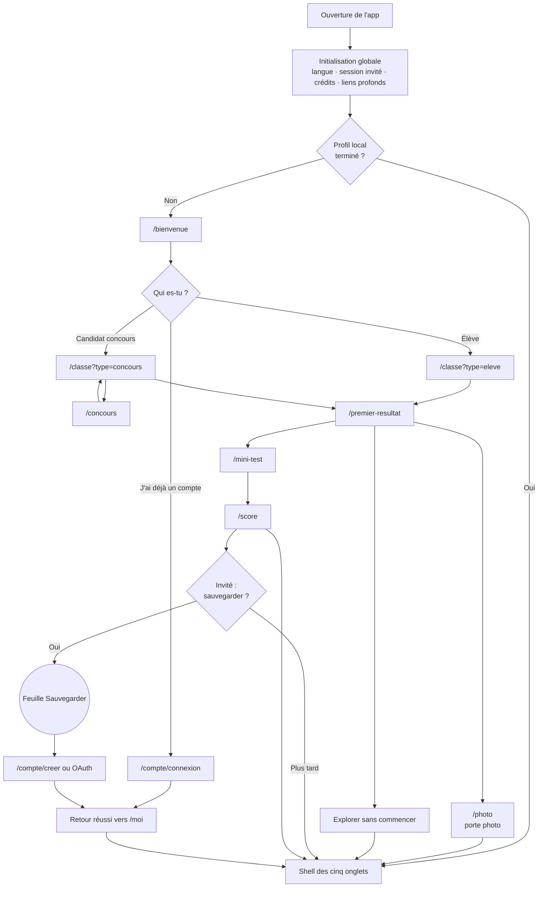
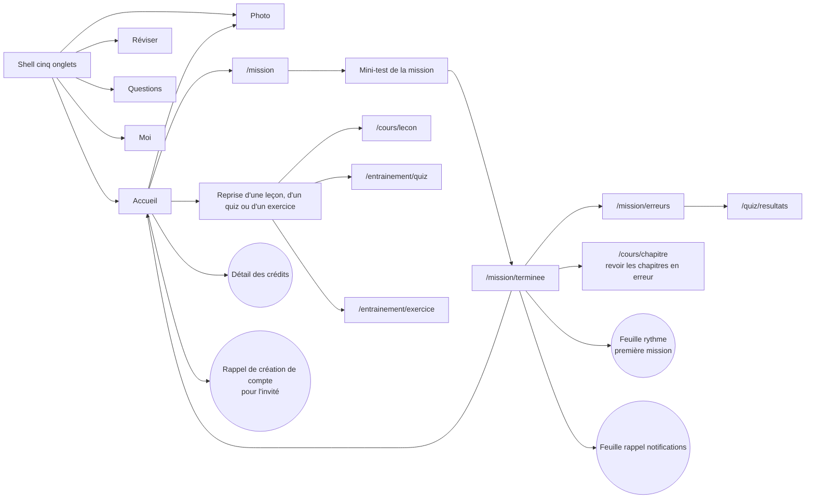
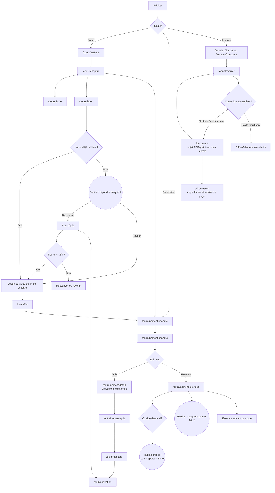
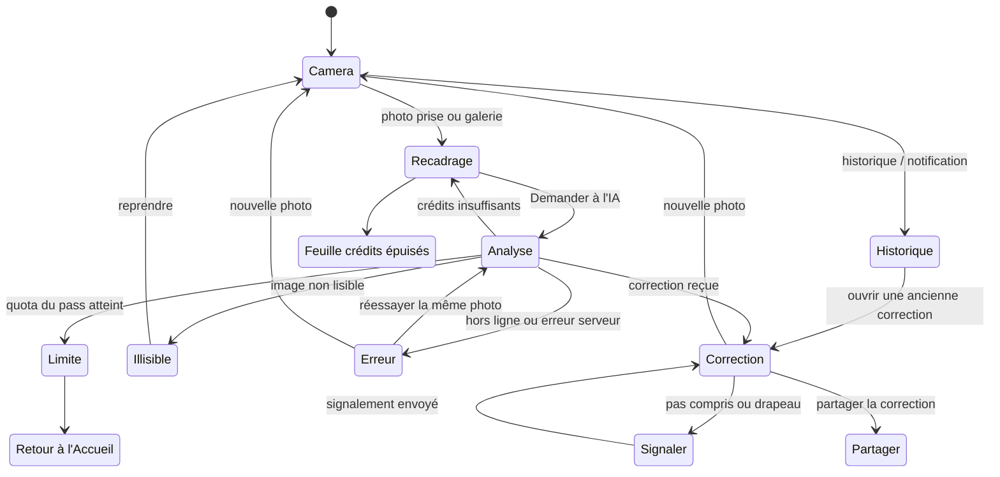
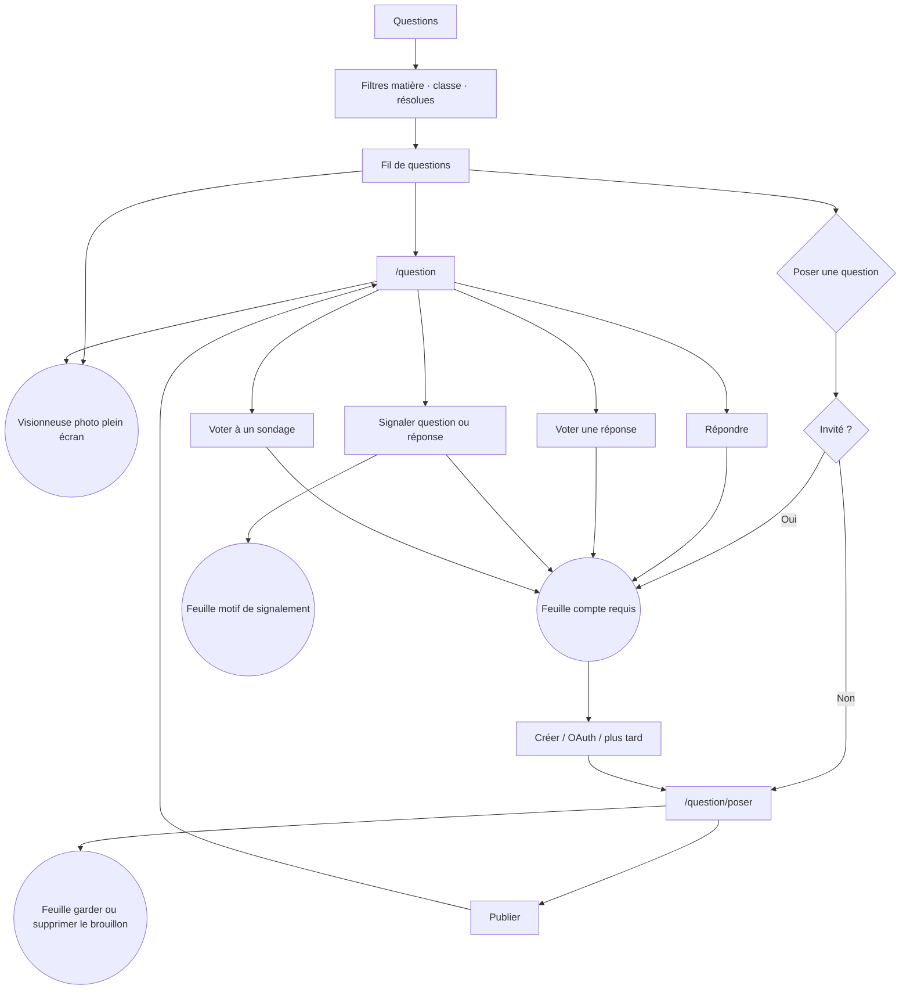
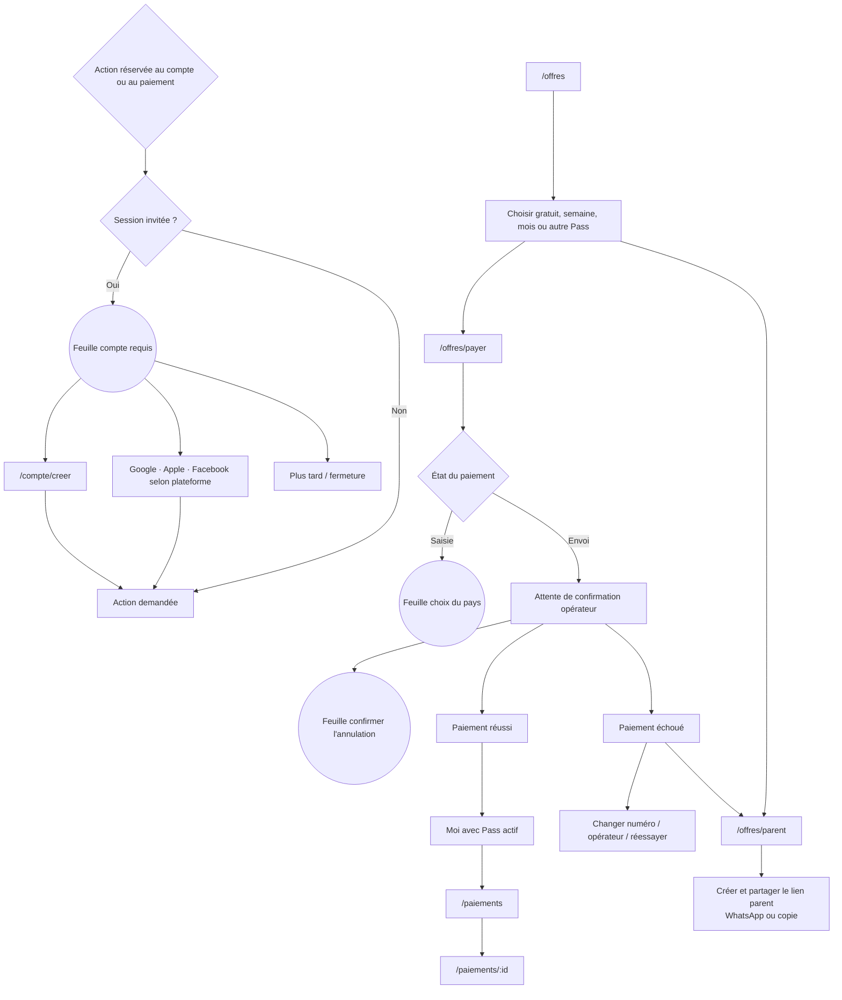
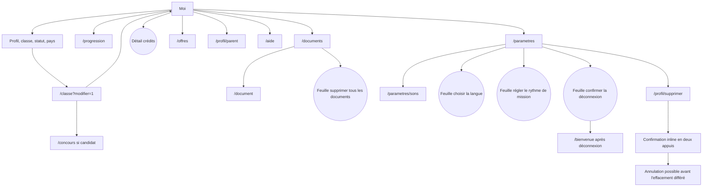

# Diagramme des parcours utilisateur — Elearn Prepa

Ce document décrit les parcours réellement implémentés dans `elearn-app`, à partir des routes Expo Router et des composants utilisés par ces routes.

## Légende

- Un rectangle représente un écran ou une zone de navigation.
- Un losange représente une décision ou un garde-fou.
- Un nœud arrondi représente une feuille du bas, une modale ou un message superposé.
- Les parcours internes à un même écran sont indiqués comme des états, car ils ne changent pas de route.

## 1. Entrée dans l’application et onboarding

### Détails importants

- La session Supabase invitée est créée avant l’affichage fonctionnel. L’utilisateur peut donc commencer sans compte.
- Les choix de statut, niveau, pays et concours sont conservés localement.
- Le parcours concours est réellement en deux temps : choix de la filière, choix du concours, retour vers la sélection de niveau, puis validation vers le premier résultat.
- Le mini-test termine l’arrivée à l’ouverture de `/score`. La photo et « Explorer sans commencer » terminent l’arrivée directement avant d’ouvrir leur destination.
- La création d’un compte par e-mail depuis un invité convertit le même utilisateur et conserve sa progression locale. Une connexion sociale peut, selon le fournisseur et le compte existant, rattacher l’identité ou ouvrir un autre compte.

## 2. Navigation principale et mission du jour

Le compteur de crédits en haut de l’Accueil et de Réviser ouvre une feuille de détail. La carte de crédits dans Moi ouvre la même feuille. Les actions liées au compte, au paiement ou à la question passent par le garde-fou compte invité.

## 3. Parcours Réviser

### Branches de Réviser

- **Cours** : matière → chapitre → fiche optionnelle ou leçon → quiz de validation → leçon suivante / fin de chapitre.
- **S’entraîner** : filtre par matière → chapitre → quiz ou exercice. Les quiz terminés mènent à la correction ; les exercices ont des confirmations de sortie et un corrigé potentiellement payant.
- **Annales** : les dossiers de classe et concours mènent à des sujets ; chaque PDF est ouvert dans le lecteur interne et peut être conservé hors ligne.

## 4. Aide par photo

Le parcours Photo est une machine à états dans la route `/photo` :

Depuis une notification « correction prête », le lien ouvre `/photo?historique=1`, puis l’état Historique.

## 5. Questions et communauté

Le fil garde une copie locale hors ligne. Les réponses échouées restent visibles avec « Réessayer » ou « Supprimer ».

## 6. Compte, Pass et paiement

Les pages `/offres` sont ouvertes depuis le score, la limite de crédits, les annales, l’Accueil, Moi, la carte de crédits et les feuilles de paiement.

## 7. Parcours Moi et réglages

## 8. Inventaire des feuilles, modales, popups et messages

### Overlays globaux

| Overlay | Déclencheur | Sorties principales |
|---|---|---|
| `FeuilleMiseAJour` | Mise à jour OTA disponible | Mettre à jour, Plus tard, Réessayer ; obligatoire = écran bloquant plein écran |
| `BienvenueCredits` | Bonus après création ou liaison d’un compte | Récupérer le bonus |
| `FeuilleCompte` | Paiement, parent, question, rappel compte | Créer par e-mail, Google/Apple/Facebook, Plus tard ; reprend l’action après réussite |
| `FeuilleSauvegarde` | Score du mini-test pour un invité | Créer/lier un compte ou Plus tard |
| `FeuilleDetailCredits` | Pastille crédits, carte Moi | Voir les Pass ; créer un compte si invité |
| `FeuilleCout` | Action coûtant au moins le seuil de confirmation | Confirmer la dépense, annuler, voir les Pass |
| `FeuilleEpuise` | Solde insuffisant | Créer un compte, Pass, demander au parent, attendre la recharge, fermer |
| Feuille de limite crédits | Limite IA du Pass atteinte | Compris |

### Overlays contextualisés

| Zone | Overlay / confirmation |
|---|---|
| Fin de mission | Réglage du rythme en deux étapes ; puis rappel quotidien des notifications |
| Leçon | Invitation à répondre au quiz ou à passer à la suite |
| Exercice | Hors ligne ; marquer comme fait avant de continuer ; confirmer la sortie |
| Résultats quiz | Liste des leçons ratées quand il y en a plusieurs |
| Questions | Menu d’une réponse ; feuille de signalement ; feuille conserver/supprimer le brouillon |
| Annales | Feuille d’erreur réseau pour l’ouverture payante |
| Documents | Confirmation « tout supprimer » |
| Paiement | Choix du pays ; confirmation d’annulation pendant l’attente opérateur |
| Ancien compte / parent | Modale native de choix de l’indicatif téléphonique |
| Questions avec photo | Modale native visionneuse plein écran avec zoom et gestes |

### Messages non modaux

Les `Banniere` inline couvrent les états succès, information, alerte et erreur : compte, hors ligne, numéro masqué, signalement envoyé, paiement, suppression de compte, rappel refusé, documents indisponibles, correction photo, etc. Le lecteur PDF affiche aussi un toast temporaire de reprise à la dernière page.

## 9. Constats de couverture

- Le fournisseur de visite guidée est installé à la racine, mais aucun appel à `useVisite().demarrer(...)` n’est actuellement présent dans le code : aucune visite ne se déclenche par elle-même.
- Il n’y a pas d’appel `Alert.alert` repéré : les confirmations métier utilisent principalement des feuilles du bas ou des bannières inline.
- `/auth/callback` est une route technique de retour OAuth qui redirige vers `/moi`.
- `/mise-a-jour` est une route de développement d’aperçu ; la mise à jour réelle est montée globalement dans le layout racine.
- `/compte/ancien`, `/annales/autres` et `/credits` existent comme routes, mais aucune entrée interne évidente n’a été repérée pour les ouvrir depuis la navigation actuelle. Elles restent accessibles par lien direct ou peuvent être conservées pour une prochaine itération.
