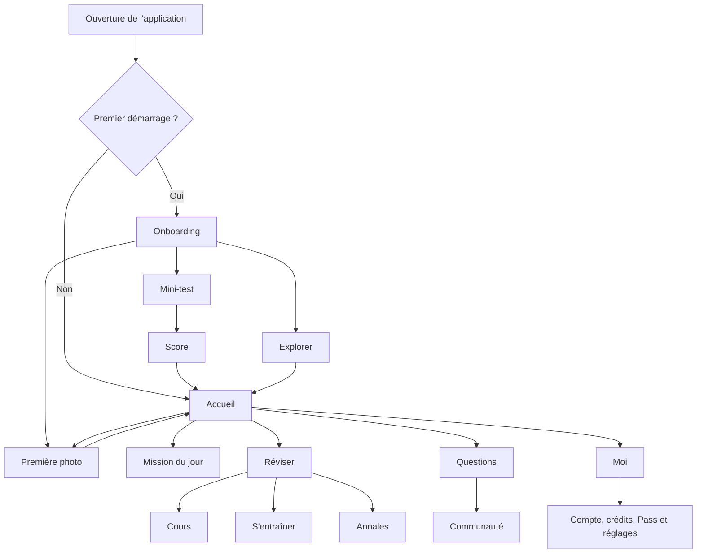

# Parcours types d’un utilisateur — Elearn Prepa

Ce document transforme la cartographie technique en scénarios utilisateurs concrets. Il décrit le chemin nominal, les embranchements les plus fréquents et les sorties attendues.

## Vue d’ensemble



## 1. Le nouvel utilisateur qui veut simplement commencer

**Profil :** élève sans compte, arrivé pour découvrir l’application.

```text
Ouverture
  → /bienvenue
  → choisir « Élève »
  → /classe?type=eleve
  → /premier-resultat
  → choisir « Explorer »
  → /
  → consulter la mission du jour ou Réviser
```

**Comportement attendu :** aucune création de compte ne doit bloquer la découverte. La session invitée est créée automatiquement et la progression peut commencer localement.

**Sorties possibles :**

- aller vers la mission du jour ;
- ouvrir directement Photo ;
- ouvrir Réviser ;
- fermer l’application et reprendre plus tard depuis l’Accueil.

## 2. Le nouvel utilisateur qui veut mesurer son niveau

**Profil :** élève qui veut un diagnostic rapide dès la première ouverture.

```text
/bienvenue
  → /classe
  → /premier-resultat
  → « Faire le mini-test »
  → /mini-test
  → /score
  → consulter les erreurs et recommandations
  → /
```

À `/score`, l’utilisateur invité peut rencontrer `FeuilleSauvegarde` :

- créer ou relier un compte pour conserver ses résultats ;
- fermer la feuille et continuer sans compte ;
- revenir ensuite vers Moi pour créer son compte.

## 3. Le candidat à un concours

**Profil :** utilisateur qui doit sélectionner une filière et un concours précis.

```text
/bienvenue
  → choisir « Candidat concours »
  → /classe?type=concours
  → /concours
  → choisir la filière
  → choisir le concours
  → retour vers /classe
  → /premier-resultat
  → mini-test, Photo ou exploration
```

Le choix du concours est une branche supplémentaire de l’arrivée, pas une destination isolée. Il personnalise ensuite les contenus de Cours, Entraînement et Annales.

## 4. L’utilisateur récurrent qui fait sa mission quotidienne

**Profil :** utilisateur déjà configuré qui revient régulièrement.

```text
Ouverture
  → /
  → carte « Mission du jour »
  → /mission
  → mini-test de mission
  → /mission/terminee
  → retour à l'Accueil
```

**Après la mission :**

- si des réponses sont fausses, ouvrir les erreurs ;
- consulter `/quiz/resultats` puis la correction ;
- revoir le chapitre concerné dans `/cours/chapitre` ;
- lors de la première mission, voir `FeuilleRythme`, puis `FeuilleRappel` pour les notifications.

## 5. L’utilisateur qui révise un cours

**Profil :** utilisateur qui suit le parcours pédagogique structuré.

```text
/reviser
  → onglet Cours
  → /cours/matiere
  → /cours/chapitre
  → /cours/fiche (optionnel)
  → /cours/lecon
  → feuille « répondre au quiz ? » si la leçon n'est pas validée
  → /cours/quiz
  → score suffisant
  → leçon suivante ou /cours/fin
```

**Branche d’échec :** score insuffisant → réessayer ou revenir à la leçon. La correction peut être consultée depuis le quiz ou les résultats selon le contexte.

## 6. L’utilisateur qui s’entraîne rapidement

**Profil :** utilisateur qui ne veut pas suivre tout le cours et cherche une pratique ciblée.

```text
/reviser
  → onglet S'entraîner
  → /entrainement/chapitre
  → choisir un quiz ou un exercice
```

### Quiz

```text
→ /entrainement/detail si des sessions existent
→ /entrainement/quiz
→ /quiz/resultats
→ /quiz/correction
```

### Exercice

```text
→ /entrainement/exercice
→ demander le corrigé
→ confirmer le coût si nécessaire
→ afficher le corrigé
→ exercice suivant ou sortie
```

Les feuilles de crédits apparaissent en cas de coût, de solde insuffisant ou de limite atteinte. Une feuille de confirmation peut aussi apparaître avant de marquer un exercice comme fait ou de quitter une session.

## 7. L’utilisateur qui résout un problème par photo

**Profil :** utilisateur bloqué sur un exercice qui veut une aide immédiate.

```text
Accueil ou onglet Photo
  → /photo
  → prendre une photo ou choisir dans la galerie
  → recadrer
  → lancer l'analyse
  → attendre la correction
  → lire la correction
```

**Branches secondaires :**

- image illisible → reprendre la photo ;
- erreur réseau ou serveur → réessayer ou prendre une nouvelle photo ;
- crédits insuffisants → `FeuilleEpuise` puis compte, Pass ou attente ;
- limite du Pass atteinte → feuille de limite puis retour à l’Accueil ;
- correction incomprise → signaler ;
- correction reçue plus tard → notification → `/photo?historique=1` → historique → correction.

## 8. L’utilisateur qui consulte ou pose une question

**Profil :** utilisateur qui cherche une explication auprès de la communauté.

### Consulter

```text
/questions
  → filtrer par matière, classe ou statut
  → ouvrir /question
  → lire les réponses
  → ouvrir une photo en plein écran si nécessaire
```

### Interagir

```text
/question
  → répondre, voter ou signaler
  → si invité : FeuilleCompte
  → créer/relier un compte ou fermer
  → reprendre l'action initiale
```

### Poser une question

```text
/questions
  → bouton « poser »
  → FeuilleCompte si invité
  → /question/poser
  → saisir le texte, la matière et la classe
  → ajouter une photo par caméra ou galerie
  → publier
  → /question
```

Si l’utilisateur quitte le composeur avec un brouillon, une feuille lui propose de le conserver ou de le supprimer. Une question ou une réponse en attente peut rester visible hors ligne avec une action de réessai.

## 9. L’utilisateur invité qui crée enfin son compte

**Profil :** utilisateur ayant déjà commencé sa progression et qui veut la conserver ou utiliser une fonction protégée.

```text
Action protégée
  → FeuilleCompte
  → e-mail, Google, Apple ou Facebook selon la plateforme
  → création/liaison du compte
  → BienvenueCredits si un bonus est disponible
  → reprise de l'action initiale
```

Les déclencheurs les plus probables sont :

- sauvegarder le score du mini-test ;
- répondre ou voter dans Questions ;
- poser une question ;
- acheter un Pass ;
- demander un accompagnement parent ;
- répondre au rappel de création de compte sur l’Accueil.

## 10. L’utilisateur qui achète un Pass

**Profil :** utilisateur arrivé à une limite ou souhaitant débloquer plus de contenu.

```text
crédits insuffisants ou accès payant
  → FeuilleCout / FeuilleEpuise / feuille de limite
  → /offres
  → choisir une offre
  → /offres/payer
  → choisir le pays
  → saisir opérateur, numéro et code
  → attente de confirmation
```

**Résultats :**

- paiement réussi → Pass actif et retour vers Moi ou l’action initiale ;
- paiement échoué → modifier le numéro/opérateur ou réessayer ;
- abandon pendant l’attente → feuille de confirmation ;
- besoin d’un parent → `/offres/parent`, puis lien à partager par WhatsApp ou à copier.

## 11. L’utilisateur qui gère son compte

```text
/moi
  → progression
  → documents enregistrés
  → historique des paiements
  → modifier la classe ou le concours
  → profil parent
  → aide
  → paramètres
```

Dans Paramètres, les branches secondaires sont la langue, le rythme des missions, les sons, la déconnexion et la suppression du compte. La suppression passe par une confirmation inline et un délai d’effacement différé.

## Parcours prioritaires à tester en premier

| Priorité | Parcours | Pourquoi il est critique |
|---|---|---|
| 1 | Premier démarrage → mini-test → score → Accueil | Active la majorité des nouveaux utilisateurs |
| 2 | Accueil → mission → erreurs → cours | Boucle de rétention et de progression |
| 3 | Photo → analyse → correction | Promesse centrale d’aide immédiate |
| 4 | Réviser → cours → quiz | Parcours pédagogique principal |
| 5 | Invité → FeuilleCompte → reprise de l’action | Conversion sans perte de contexte |
| 6 | Crédits → offres → paiement | Monétisation et gestion des limites |
| 7 | Questions → poser → publication | Valeur communautaire et contenu généré |

## Points de contrôle UX communs

- Toujours afficher une sortie claire quand une feuille est fermée.
- Conserver l’action initiale après la création ou la connexion du compte.
- Indiquer si une action consomme des crédits avant la confirmation.
- Prévoir un état explicite hors ligne pour les parcours Photo, Questions et Documents.
- Permettre de retrouver les corrections et documents depuis Moi, même après une interruption.
- Distinguer visuellement une feuille d’action, une modale native et une bannière inline.
