# Sitemap — Elearn Prepa

## Carte hiérarchique de l’expérience

```mermaid
flowchart TD
    APP[Elearn Prepa]

    APP --> ARR[Parcours d'arrivée]
    ARR --> BIENV["/bienvenue"]
    ARR --> CLASSE["/classe"]
    ARR --> CONCOURS["/concours"]
    ARR --> PREMIER["/premier-resultat"]
    ARR --> MINI["/mini-test"]
    ARR --> SCORE["/score"]

    APP --> TABS[Shell principal · cinq onglets]
    TABS --> ACC["/ · Accueil"]
    TABS --> REVISER["/reviser · Réviser"]
    TABS --> PHOTO["/photo · Photo"]
    TABS --> QUESTIONS["/questions · Questions"]
    TABS --> MOI["/moi · Moi"]

    ACC --> MISSION["/mission"]
    MISSION --> MISSION_FIN["/mission/terminee"]
    MISSION_FIN --> MISSION_ERREURS["/mission/erreurs"]
    MISSION_ERREURS --> QUIZ_RESULTATS["/quiz/resultats"]

    REVISER --> COURS[Onglet Cours]
    COURS --> MATIERE["/cours/matiere"]
    MATIERE --> CHAPITRE["/cours/chapitre"]
    CHAPITRE --> FICHE["/cours/fiche"]
    CHAPITRE --> LECON["/cours/lecon"]
    LECON --> QUIZ_LECON["/cours/quiz"]
    CHAPITRE --> FIN_CHAPITRE["/cours/fin"]

    REVISER --> ENTRAINEMENT[Onglet S'entraîner]
    ENTRAINEMENT --> ENTRAINEMENT_CHAPITRE["/entrainement/chapitre"]
    ENTRAINEMENT_CHAPITRE --> DETAIL_QUIZ["/entrainement/detail"]
    ENTRAINEMENT_CHAPITRE --> QUIZ_LIBRE["/entrainement/quiz"]
    ENTRAINEMENT_CHAPITRE --> EXERCICE["/entrainement/exercice"]
    QUIZ_LIBRE --> QUIZ_RESULTATS
    QUIZ_RESULTATS --> QUIZ_CORRECTION["/quiz/correction"]

    REVISER --> ANNALES[Onglet Annales]
    ANNALES --> DOSSIER["/annales/dossier"]
    ANNALES --> ANNALES_CONCOURS["/annales/concours"]
    DOSSIER --> SUJET["/annales/sujet"]
    ANNALES_CONCOURS --> SUJET
    SUJET --> DOCUMENT["/document"]
    ANNALES --> DOCUMENTS["/documents"]
    DOCUMENTS --> DOCUMENT

    PHOTO --> PHOTO_ETATS[États internes : caméra · recadrage · analyse · correction · historique · signalement · limites]

    QUESTIONS --> QUESTION["/question"]
    QUESTIONS --> POSER["/question/poser"]
    QUESTION --> PHOTO_PLEINE[Visionneuse photo plein écran]

    MOI --> PROGRESSION["/progression"]
    MOI --> CREDITS["/credits"]
    MOI --> PAIEMENTS["/paiements"]
    PAIEMENTS --> PAIEMENT_DETAIL["/paiements/:id"]
    MOI --> CLASSE_MODIF["/classe?modifier=1"]
    MOI --> PARENT["/profil/parent"]
    MOI --> SUPPRESSION["/profil/supprimer"]
    MOI --> AIDE["/aide"]
    MOI --> PARAMETRES["/parametres"]
    PARAMETRES --> SONS["/parametres/sons"]
    PARAMETRES --> DOCUMENTS

    APP --> COMPTE[Compte]
    COMPTE --> CREER["/compte/creer"]
    COMPTE --> CONNEXION["/compte/connexion"]
    COMPTE --> ANCIEN["/compte/ancien"]
    COMPTE --> CALLBACK["/auth/callback"]

    APP --> PASS[Pass et paiement]
    PASS --> OFFRES["/offres"]
    PASS --> PARENT_PASS["/offres/parent"]
    PASS --> PAYER["/offres/payer"]

    APP --> LIENS[Entrées externes]
    LIENS --> REJOINDRE["/rejoindre/:code"]
    LIENS --> REF[?ref=code sur un lien d'ouverture]

    APP --> DEV[Développement]
    DEV --> UPDATE["/mise-a-jour"]
```



## Sitemap par zone

### A. Parcours d’arrivée

| Route | Écran | Rôle |
|---|---|---|
| `/bienvenue` | Bienvenue | Choisir élève, concours ou connexion |
| `/classe` | Classe / concours | Niveau, statut et pays ; réutilisée depuis Moi avec `modifier=1` |
| `/concours` | Choix concours | Filière puis concours précis |
| `/premier-resultat` | Premier résultat | Porte Photo, porte Mini-test ou exploration |
| `/mini-test` | Mini-test | Répondre aux questions d’évaluation |
| `/score` | Score | Résultat, leçon à revoir, sauvegarde du résultat |

### B. Navigation principale

| Onglet | Route | Contenu |
|---|---|---|
| Accueil | `/` | Mission du jour, reprise, accès Photo, crédits |
| Réviser | `/reviser` | Cours, entraînement, annales |
| Photo | `/photo` | Résolution par photo et historique des corrections |
| Questions | `/questions` | Fil communautaire, filtres, publication |
| Moi | `/moi` | Profil, crédits/Pass, progression, documents, aide et réglages |

### C. Réviser — cours

```text
/reviser
└── Cours
    └── /cours/matiere
        └── /cours/chapitre
            ├── /cours/fiche
            ├── /cours/lecon
            │   └── /cours/quiz
            ├── /cours/fin
            └── /entrainement/chapitre
```

### D. Réviser — entraînement

```text
/reviser
└── S'entraîner
    └── /entrainement/chapitre
        ├── /entrainement/detail
        │   └── /entrainement/quiz
        ├── /entrainement/quiz
        │   └── /quiz/resultats
        │       └── /quiz/correction
        └── /entrainement/exercice
```

### E. Réviser — annales et documents

```text
/reviser
└── Annales
    ├── /annales/dossier
    │   └── /annales/sujet
    ├── /annales/concours
    │   └── /annales/sujet
    └── /annales/sujet
        └── /document

/documents
└── /document
```

Les sujets gratuits, les sujets déjà ouverts et les corrections autorisées ouvrent `/document`. L’ouverture d’un contenu payant passe par les crédits ou le Pass avant d’arriver au lecteur PDF.

### F. Questions

```text
/questions
├── /question
│   ├── répondre dans le composeur
│   ├── voter / voter à un sondage
│   ├── signaler la question ou une réponse
│   └── visionneuse photo plein écran
└── /question/poser
    ├── texte
    ├── matière et classe
    ├── caméra ou galerie
    └── publication → /question
```

### G. Moi, compte et réglages

```text
/moi
├── /progression
├── /credits
├── /documents
├── /paiements
│   └── /paiements/:id
├── /classe?modifier=1
│   └── /concours
├── /profil/parent
├── /profil/supprimer
├── /aide
└── /parametres
    ├── /parametres/sons
    ├── feuille langue
    ├── feuille rythme
    ├── feuille déconnexion
    └── /profil/supprimer

/compte
├── /compte/creer
├── /compte/connexion
└── /compte/ancien
```

### H. Pass et paiement

```text
/offres
├── /offres/payer
│   ├── feuille choix du pays
│   ├── saisie opérateur / numéro / code
│   ├── attente de confirmation
│   ├── succès
│   └── échec / reprise / demande au parent
└── /offres/parent
    └── lien à envoyer par WhatsApp ou à copier
```

## Routes techniques, cachées ou faiblement reliées

| Route | Statut dans l’application |
|---|---|
| `/auth/callback` | Retour OAuth technique ; redirige vers `/moi` |
| `/rejoindre/:code` | Capture un code de parrainage puis redirige vers `/` |
| `/mise-a-jour` | Aperçu développeur d’une mise à jour ; inaccessible en production normale |
| `/compte/ancien` | Route de récupération d’un ancien compte ; aucune entrée interne évidente repérée |
| `/annales/autres` | Vue « autres concours » conservée ; aucune entrée interne évidente repérée dans la navigation actuelle |
| `/credits` | Détail crédits en écran dédié ; l’expérience actuelle utilise surtout la feuille depuis Accueil/Moi |

## Règles de navigation transversales

1. Le profil local non terminé redirige les onglets vers `/bienvenue`.
2. Les actions « compte requis » ouvrent une feuille avant de poursuivre l’action initiale.
3. Le bouton retour utilise la pile quand elle existe et retombe sinon vers `/`, `/reviser` ou `/moi` selon la zone.
4. Le Pass et les crédits sont des branches transversales appelées depuis Mission, Photo, Annales, Moi et les corrections.
5. Les documents ouverts sont conservés localement et restent accessibles via `/documents`.
